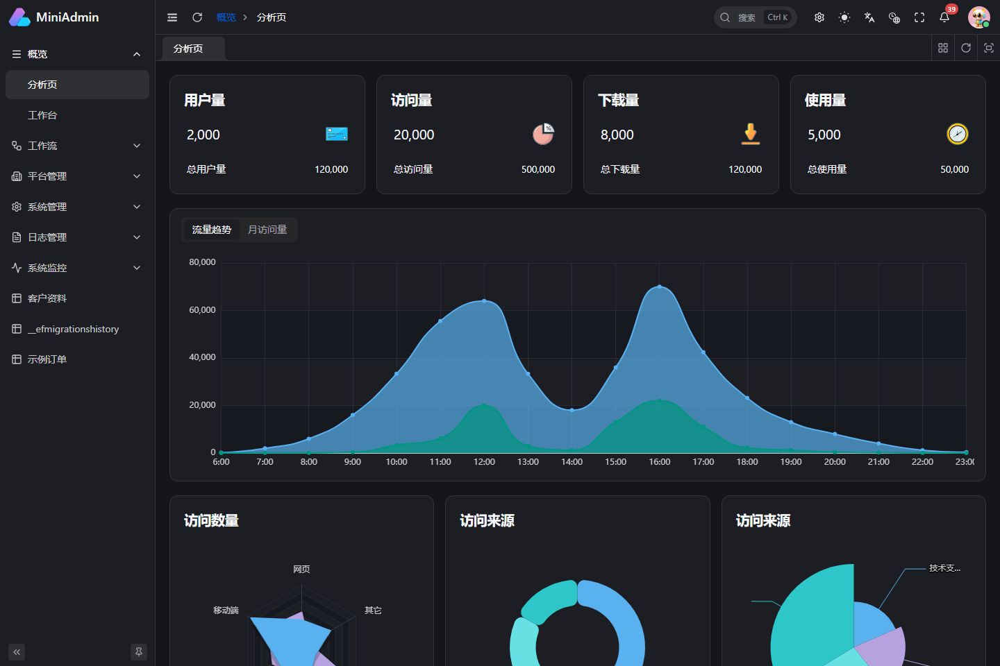
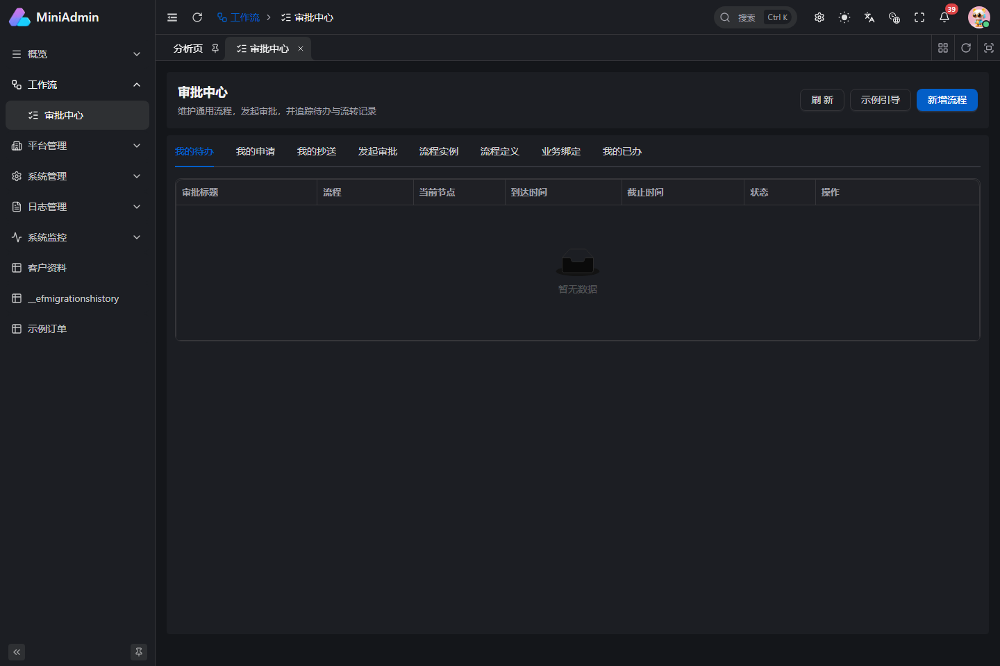
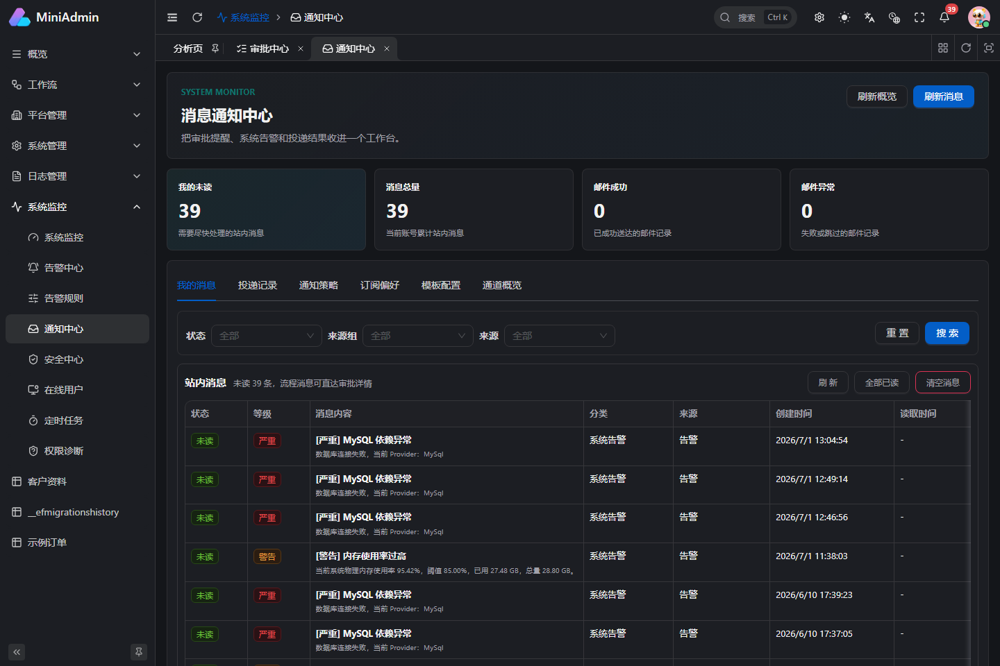
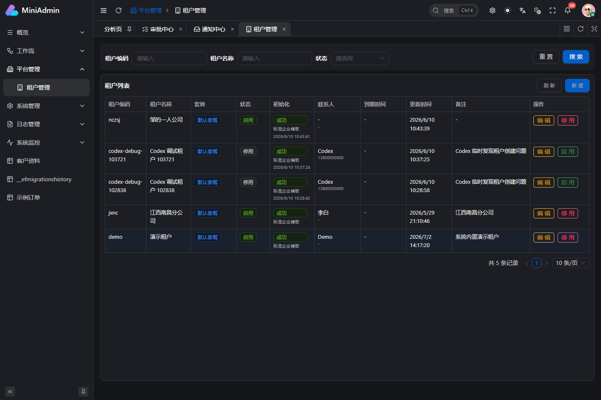
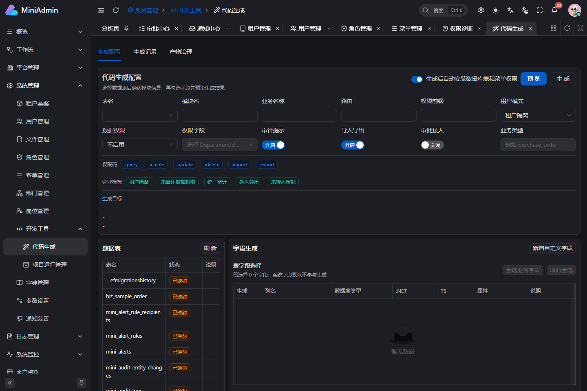
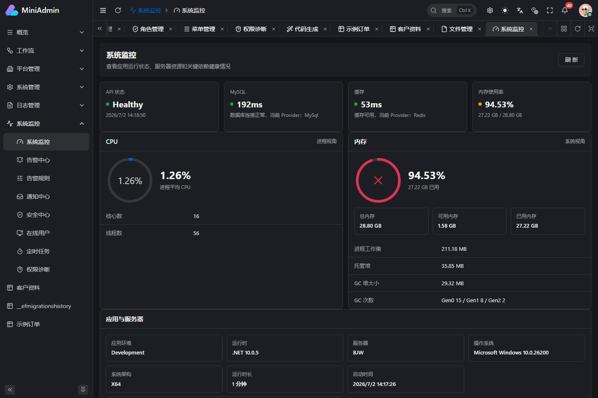

<p align="center">
  
</p>

# MiniAdmin

企业级 SaaS 中后台基础平台。后端基于 .NET 10 与 ASP.NET Core，前端基于 Vue 3 与 Vben Admin，提供多租户、RBAC 权限、工作流、消息中心、审计、代码生成、事件总线、工作单元、网关和运维监控等开箱即用能力。

[](https://gitee.com/baijincom/mini-admin/stargazers)
[](https://github.com/tellmevx-cell/mini-admin)
[](https://github.com/tellmevx-cell/mini-admin/actions/workflows/ci.yml)
[](LICENSE)
[](src/MiniAdmin.Api)
[](frontend/vue-vben-admin)
[](docs-site)

[功能总览](#功能概览) · [界面预览](#界面预览) · [快速开始](#快速开始) · [Docker 部署](docs-site/guide/docker-compose.md) · [二开文档](docs-site/index.md) · [参与贡献](CONTRIBUTING.md)

## 简介

MiniAdmin 采用前后端分离架构，后端按 `Domain / Application / Infrastructure / Api` 分层，前端由后端菜单动态驱动路由。项目不是只展示增删改查的示例模板，而是一套可以继续承载真实业务模块的后台基础工程。

你可以保留完整平台能力直接开发业务，也可以按需裁剪租户、工作流、消息、网关等模块。默认使用 InMemory 和 Memory Cache 即可启动体验，生产环境可切换到 MySQL 与 Redis，并通过 Docker Compose 在 Linux 或 1Panel 服务器上一键部署。

**适用场景**

- 企业内部管理后台、运营平台和数据管理系统。
- SaaS 多租户产品、客户工作台和平台管理端。
- 带审批、抄送、催办和消息通知的流程型业务。
- 需要快速生成 CRUD，再逐步沉淀领域逻辑的业务系统。
- .NET 10 + Vue 3 前后端分离项目的学习、验证和二开底座。

## 界面预览

<table>
  <tr>
    <td align="center"><br />分析页</td>
    <td align="center"><br />审批中心</td>
  </tr>
  <tr>
    <td align="center"><br />消息中心</td>
    <td align="center"><br />租户管理</td>
  </tr>
  <tr>
    <td align="center"><br />代码生成</td>
    <td align="center"><br />系统监控</td>
  </tr>
</table>

仓库内已提供 20 张真实功能截图，详见 [功能截图展示](docs-site/features/showcase.md)。所有截图都可以通过 `pnpm screenshots:features` 在本地重新生成。

## 为什么选择 MiniAdmin

- **可直接二开**：后端按 `Domain / Application / Infrastructure / Api` 分层，前端基于 Vben Admin，菜单、权限、业务模块都有清晰扩展入口。
- **真实后台能力**：内置用户、角色、菜单、部门、岗位、字典、参数、文件、通知、审计、登录安全、在线用户和系统监控。
- **工作流优先**：支持流程定义、审批中心、条件分支、抄送节点、审批记录、消息提醒和业务绑定。
- **SaaS 多租户**：支持平台租户、租户套餐、租户初始化模板、租户管理员开通和租户数据隔离。
- **代码生成器**：支持从表结构生成可运行 CRUD，并沉淀生成历史、产物治理、回滚和工作流绑定能力。
- **工程化完整**：包含测试、文档站、运行管理、定时任务、事件总线、工作单元和本地/生产配置说明。
- **网关可演进**：内置 `MiniAdmin.Gateway`，基于 YARP 提供统一 `/api` 入口、健康检查和入口限流，为后续微服务拆分预留边界。

## 技术栈

| 模块 | 技术 |
| --- | --- |
| 后端 | .NET 10, ASP.NET Core Minimal API, EF Core |
| 网关 | YARP Reverse Proxy, ASP.NET Core RateLimiter |
| 数据库 | 默认 InMemory，支持 MySQL |
| 缓存 | Memory Cache，支持 Redis 并具备失败兜底 |
| 前端 | Vue 3, Vben Admin, Ant Design Vue, Pinia, Vite |
| 文档 | VitePress |
| 测试 | xUnit, WebApplicationFactory |

## 架构

MiniAdmin 保持模块边界清晰，同时避免在项目早期引入不必要的分布式复杂度。当前可以作为模块化单体部署；业务规模扩大后，可通过独立的 YARP 网关逐步拆分服务。

```text
Browser
   |
   +-- Web: Vue 3 + Vben Admin + Ant Design Vue
   |
   +-- Gateway: YARP reverse proxy + rate limiting (optional)
           |
           +-- Api: authentication, authorization and endpoints
                   |
                   +-- Application: use cases and orchestration
                   +-- Domain: entities, rules and domain events
                   +-- Infrastructure: EF Core, cache, files and jobs
                           |
                           +-- MySQL / InMemory
                           +-- Redis / Memory Cache
```

| 项目 | 职责 |
| --- | --- |
| `MiniAdmin.Domain.Shared` | 领域共享常量、枚举和基础约定 |
| `MiniAdmin.Domain` | 实体、领域规则、仓储抽象和领域事件 |
| `MiniAdmin.Application.Contracts` | DTO、应用服务接口和跨层契约 |
| `MiniAdmin.Application` | 用例编排、权限校验和事务边界 |
| `MiniAdmin.Infrastructure` | EF Core、缓存、文件、通知、任务和数据初始化 |
| `MiniAdmin.Api` | HTTP API、认证授权、中间件和依赖注入入口 |
| `MiniAdmin.Gateway` | 统一 API 入口、反向代理、健康检查和限流 |

主要目录：

```text
mini-admin/
|-- src/                         # .NET 后端与网关
|-- frontend/vue-vben-admin/     # Vue 3 管理端
|-- tests/MiniAdmin.Tests/       # 后端自动化测试
|-- docs-site/                   # VitePress 使用与二开文档
|-- docs/                        # 功能需求、设计和运行手册
|-- scripts/                     # 部署、验证和截图脚本
|-- docker-compose.yml           # 完整容器编排
`-- deploy.sh                    # Linux / 1Panel 一键部署入口
```

## 功能概览

### 系统基础

- JWT 登录、验证码、登录失败锁定、密码策略和在线会话管理。
- 用户、角色、菜单、权限码、部门、岗位、字典、系统参数和公告管理。
- RBAC 权限控制、数据权限、权限诊断链路和缓存刷新。
- 审计日志、实体变更追踪、安全事件和操作日志。

### SaaS 租户

- 平台租户管理、租户启停、到期控制和登录租户选项。
- 租户套餐与菜单授权。
- 租户管理员自动开通。
- 标准企业模板初始化部门、岗位、角色和基础权限。
- 租户内角色、部门、岗位编码唯一，避免多租户基础数据冲突。

### 工作流与消息中心

- 流程定义、流程实例、审批任务、我的待办、我的申请、我的抄送和我的已办。
- 审批节点、条件节点、抄送节点、结束节点和可视化流程画布。
- 审批附件、评论、催办、撤回、版本发布和业务表单绑定。
- 消息通知中心、已读/未读追踪、模板中心、通知策略和投递重试。

### 运维与平台能力

- 文件上传、下载、异常文件标记和存储一致性检查。
- 定时任务、任务日志、系统监控看板和告警中心。
- 项目运行管理，可在管理端查看服务、日志、构建和产物。
- 本地事件总线和工作单元，便于扩展领域事件和事务边界。
- MiniAdmin.Gateway 网关，支持 `/api` 统一代理、网关健康检查和入口限流。

### 代码生成与二开

- 表结构读取、字段选择、查询条件、控件类型和字典绑定。
- 生成前预览、生成后安装、生成历史、产物治理和回滚。
- 支持生成业务模块，并可绑定工作流审批。

## 功能截图展示

功能展示图已沉淀到文档站，适合 GitHub 访客快速了解系统界面和能力边界：

- [功能截图展示](docs-site/features/showcase.md)
- [功能总览](docs-site/features/overview.md)
- [工作流与消息中心运行手册](docs-site/runbooks/workflow-message-center.md)

如果你在本地启动了前后端，可以重新生成截图：

```powershell
pnpm screenshots:features
```

默认访问 `http://localhost:5666`，如果你的本地前端端口不同，可以指定：

```powershell
$env:MINIADMIN_WEB_URL = "http://localhost:5600"
pnpm screenshots:features
```

## 快速开始

### 环境要求

- .NET SDK 10+
- Node.js 22.18+ 或 24+
- pnpm 11+
- MySQL 可选，默认可以直接使用 InMemory 启动
- Redis 可选，默认使用 Memory Cache

### 获取代码

国内网络推荐从 Gitee 克隆：

```bash
git clone https://gitee.com/baijincom/mini-admin.git
cd mini-admin
```

也可以使用 GitHub：

```bash
git clone https://github.com/tellmevx-cell/mini-admin.git
cd mini-admin
```

### 启动后端

```powershell
dotnet restore
dotnet run --project src/MiniAdmin.Api/MiniAdmin.Api.csproj --urls http://localhost:5021
```

健康检查：

```powershell
Invoke-WebRequest -Uri http://localhost:5021/health -UseBasicParsing
```

### 启动前端

```powershell
cd frontend/vue-vben-admin
pnpm install
pnpm run dev:antd
```

访问：

```text
http://localhost:5666
```

默认账号：

| 场景 | 租户编码 | 用户名 | 密码 |
| --- | --- | --- | --- |
| 平台管理员 | 留空 | `admin` | `123456` |
| 演示租户 | `demo` | `demo` | `123456` |

> 首次公开部署前请务必修改默认密码和 `Jwt:SigningKey`。

### Docker Compose 一键体验

如果你希望同时启动 MySQL、Redis、后端 API、YARP 网关和前端静态站点，可以使用 Docker Compose：

Linux / 1Panel 服务器推荐直接执行：

```bash
bash deploy.sh
```

脚本会自动生成生产 `.env`、按顺序构建并启动 MySQL、Redis、API、Gateway、Web，等待数据库初始化完成，并验证整条 `/api` 代理链路。失败时会直接显示对应容器日志。

国内服务器无法访问 GitHub 时，先在本机生成只包含 Git 已提交文件的部署包：

```powershell
powershell -ExecutionPolicy Bypass -File scripts/package-server.ps1
```

通过 1Panel 上传 `artifacts/deploy/mini-admin-server-*.tar.gz`，解压后执行：

```bash
cd /opt/mini-admin
bash deploy.sh
```

本地手动体验也可以执行：

```powershell
Copy-Item .env.example .env
# 编辑 .env，替换 JWT、MySQL、Redis 相关密码
docker compose up -d --build
```

访问：

```text
前端：http://localhost:5666
网关：http://127.0.0.1:8088/health
API 代理：http://127.0.0.1:8088/api/health
后端直连：http://127.0.0.1:8080/health
```

完整说明见 [Docker Compose 指南](docs-site/guide/docker-compose.md)。

### 可选启动网关

本地开发时可以在 API 旁边启动网关：

```powershell
dotnet run --project src/MiniAdmin.Api/MiniAdmin.Api.csproj --urls http://localhost:5021
dotnet run --project src/MiniAdmin.Gateway/MiniAdmin.Gateway.csproj --urls http://localhost:8088
```

网关访问：

```text
http://localhost:8088/api/health
```

详细说明见 [网关与微服务演进](docs-site/guide/gateway-microservices.md)。

## 使用 MySQL / Redis

仓库默认配置不包含任何真实密钥。开发环境推荐通过环境变量或本地忽略文件配置连接信息。

PowerShell 示例：

```powershell
$env:Database__Provider = "MySql"
$env:ConnectionStrings__MiniAdmin = "Server=127.0.0.1;Port=3306;Database=mini_admin;User=root;Password=your_password;CharSet=utf8mb4;SslMode=None;AllowPublicKeyRetrieval=True;"
$env:Cache__Provider = "Redis"
$env:Cache__Redis__Configuration = "127.0.0.1:6379,password=your_password,abortConnect=False,defaultDatabase=10"

dotnet run --project src/MiniAdmin.Api/MiniAdmin.Api.csproj --urls http://localhost:5021
```

也可以参考 [appsettings.Development.example.json](src/MiniAdmin.Api/appsettings.Development.example.json) 创建你自己的 `src/MiniAdmin.Api/appsettings.Development.json`。该文件已被 `.gitignore` 忽略，不应提交到仓库。

## 文档站

```powershell
pnpm install
pnpm docs:dev
```

构建静态文档：

```powershell
pnpm docs:build
```

文档源码位于 [docs-site](docs-site)，需求、任务和实现记录位于 [docs/features](docs/features) 与 [docs/runbooks](docs/runbooks)。

## 后端二开指南

- 新增领域对象优先放到 [src/MiniAdmin.Domain](src/MiniAdmin.Domain)。
- 对外契约放到 [src/MiniAdmin.Application.Contracts](src/MiniAdmin.Application.Contracts)。
- 应用服务放到 [src/MiniAdmin.Application](src/MiniAdmin.Application)。
- EF 仓储、缓存、文件、通知、定时任务等基础设施放到 [src/MiniAdmin.Infrastructure](src/MiniAdmin.Infrastructure)。
- API 端点注册放到 [src/MiniAdmin.Api](src/MiniAdmin.Api)。
- 新增菜单和权限时同步补种子数据、权限码和前端页面。
- 涉及事务边界和领域事件时优先使用 `IUnitOfWork` 与 `ILocalEventBus`。

## 前端二开指南

- 主应用在 [frontend/vue-vben-admin/apps/web-antd](frontend/vue-vben-admin/apps/web-antd)。
- 业务接口放到 `src/api`。
- 页面放到 `src/views`。
- 后端菜单会动态驱动前端路由，新增页面时注意组件路径与菜单 `component` 保持一致。
- 保留 Vben Admin 的工程结构，避免把业务代码散落到基础包里。

## 测试

运行后端测试：

```powershell
dotnet test tests/MiniAdmin.Tests/MiniAdmin.Tests.csproj
```

常用定向验证：

```powershell
dotnet test tests/MiniAdmin.Tests/MiniAdmin.Tests.csproj --filter PlatformInfrastructureTests
```

前端类型检查：

```powershell
cd frontend/vue-vben-admin
pnpm -F @vben/web-antd run typecheck
```

## 开源发布前检查

- 不提交 `appsettings.Development.json`、`.env.local`、日志、构建产物和本地上传文件。
- 不提交真实数据库、Redis、MinIO、SMTP、Webhook、JWT 生产密钥。
- 生产环境必须替换默认账号密码、JWT 密钥和对象存储配置。
- 如果你修改了 Vben Admin 子项目，请同时遵守其目录内的 [LICENSE](frontend/vue-vben-admin/LICENSE)。

## 贡献

欢迎提交 Issue、Pull Request、功能建议和二开实践反馈。开始前建议阅读 [CONTRIBUTING.md](CONTRIBUTING.md) 与 [SECURITY.md](SECURITY.md)。

建议贡献前先运行相关测试，并在 PR 中说明：

- 改动目的和影响范围。
- 是否包含数据库结构、权限码或菜单种子变更。
- 如何验证。

## 致谢

- [Vben Admin](https://github.com/vbenjs/vue-vben-admin) 提供了成熟的 Vue 后台前端工程基础。
- [XiHan.BasicApp](https://gitee.com/XiHanFun/XiHan.BasicApp) 的开源项目首页为 MiniAdmin 的介绍结构提供了参考。

## 许可证

MiniAdmin 使用 [MIT License](LICENSE) 开源。你可以自由使用、复制、修改、合并、发布、分发、再授权和商用，但需要保留版权与许可声明。

本仓库包含的第三方开源项目、依赖和资源仍遵循其各自许可证。
