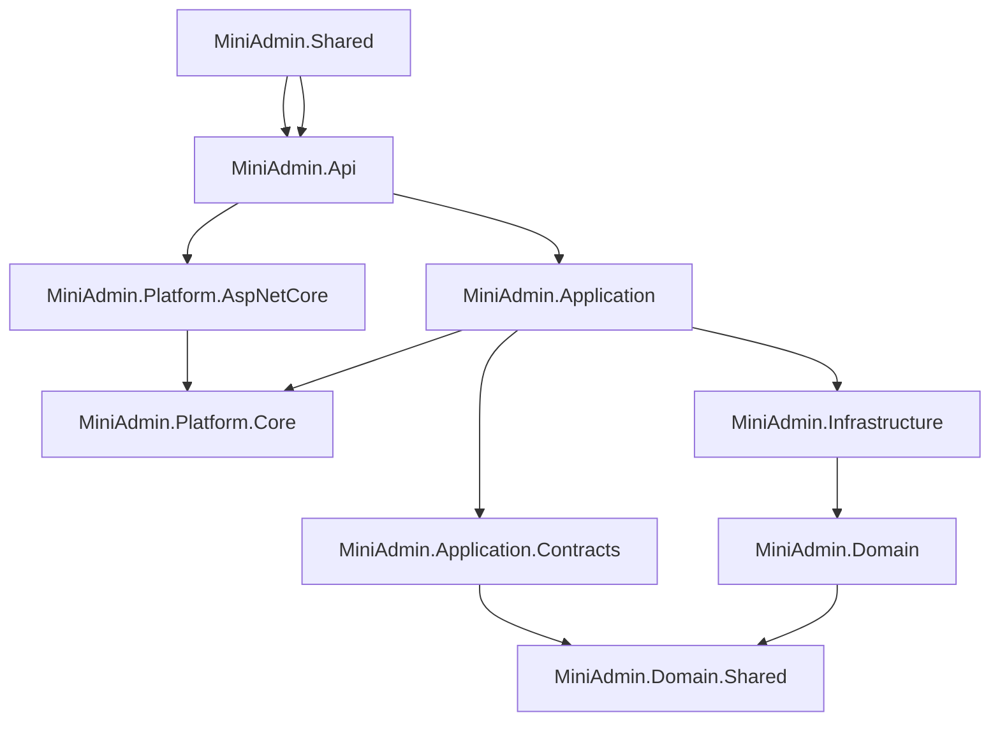
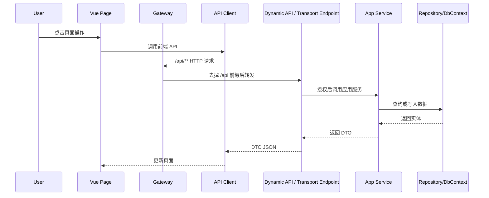

# 架构总览

MiniAdmin 后端采用分层架构，前端基于 Vben Admin Ant Design Vue。二开时最重要的是理解每一层负责什么，不要把职责写串。

## 后端分层



| 项目 | 职责 |
| --- | --- |
| `MiniAdmin.Domain.Shared` | 枚举、共享常量、跨层基础类型 |
| `MiniAdmin.Platform.Core` | Dynamic API、PageRegistry、ABAC 与平台缓存的中立契约 |
| `MiniAdmin.Platform.AspNetCore` | Dynamic API 发现、路由、参数绑定、授权和异常边界 |
| `MiniAdmin.Domain` | 实体、领域模型、领域接口 |
| `MiniAdmin.Application.Contracts` | DTO、请求对象、应用服务接口 |
| `MiniAdmin.Application` | 应用服务、业务编排、权限校验 |
| `MiniAdmin.Infrastructure` | EF Core、仓储、存储、通知、事件总线、工作单元、外部实现 |
| `MiniAdmin.Api` | HTTP 传输适配、认证授权、OpenIddict、SignalR、中间件和依赖注入 |
| `MiniAdmin.Gateway` | YARP 反向代理、灰度选择、TraceId、限流、熔断和健康检查 |
| `MiniAdmin.Shared` | API 响应包装等共享工具 |
| `tests/MiniAdmin.Tests` | 集成测试和应用服务测试 |

## 前端结构

核心目录：

```text
frontend/vue-vben-admin/apps/web-antd/src
```

常见职责：

| 目录 | 职责 |
| --- | --- |
| `api` | 前端请求封装和类型 |
| `views` | 页面实现 |
| `router` | 路由和动态菜单接入 |
| `store` | Pinia 状态 |
| `components` | 业务组件或全局组件 |

## 请求链路



## 二开原则

- 页面不要直接拼后端 URL，统一放到 `api` 目录。
- 接口不要直接返回实体，统一返回 DTO。
- 标准业务接口使用 Dynamic API，只有文件流等 HTTP 细节使用薄传输端点。
- 业务规则放应用服务，不放 HTTP 传输层。
- 数据库实现放 Infrastructure，不放 Application。
- 复杂写操作优先通过 `IUnitOfWork` 管理事务，提交后副作用通过本地事件总线解耦。
- 网关只做入口治理和代理，不写业务规则、不查业务库。
- 页面、路由、组件、权限和国际化统一由 PageRegistry 注册。
- RBAC 权限码与 Dynamic API 的 ABAC `Resource + Action` 必须保持一致。
- 每个完整功能都要补文档和至少一组验证命令。
