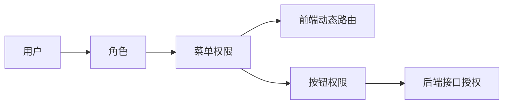

# 认证与 RBAC

认证与 RBAC 是 MiniAdmin 的访问控制基础，覆盖登录、用户、角色、菜单、按钮权限和权限诊断。

## 登录认证

后端使用 JWT 认证。登录成功后，前端保存访问令牌，并在后续接口请求中携带令牌。

相关能力：

- 用户名密码登录。
- 当前用户信息查询。
- 修改密码。
- 登出。
- 登录日志。
- 在线用户。
- 多会话管理和会话失效。

## 用户管理

用户管理用于维护后台账号。

常见字段：

- 用户名。
- 昵称。
- 手机号或邮箱。
- 状态。
- 部门。
- 岗位。
- 角色。

二开建议：

- 不要把业务资料硬塞进用户表。
- 业务扩展信息建议建独立表，通过 `UserId` 关联。
- 密码、锁定、状态变更应记录审计日志。

## 角色和菜单

角色用于组织权限，菜单用于控制前端可见页面和按钮。

权限链路：



## 权限命名

推荐格式：

```text
module:resource:action
```

示例：

```text
system:user:query
system:user:create
workflow:center:approve
notification:policy:update
```

## 数据权限

数据权限用于控制用户能看到哪些组织范围的数据。

常见范围：

- 全部数据。
- 本部门数据。
- 本部门及下级部门数据。
- 仅本人数据。
- 自定义部门数据。

二开业务模块时，如果数据天然属于某个部门或用户，应在查询层接入数据范围过滤。

## 接口限流

后端内置 ASP.NET Core RateLimiter，默认启用：

- 全局接口限流：默认每个用户或 IP `600 次 / 60 秒`。
- 登录接口限流：默认每个 IP `10 次 / 60 秒`，用于降低撞库风险。
- 上传接口限流：默认每个用户或 IP `4` 个并发上传。
- 命中限流时返回 `HTTP 429 Too Many Requests`，响应体仍保持统一 `ApiResponse` 格式。

生产环境如果前面有 Nginx、CDN 或 1Panel 反向代理，建议同时在网关层配置基础限流。应用层限流是最后一道兜底，具体配置见 [部署上线](../guide/deployment.md#接口限流配置)。

## 权限诊断

权限诊断用于解释“为什么看不到菜单或按钮”。

排查顺序：

1. 用户是否拥有角色。
2. 角色是否分配菜单。
3. 租户套餐是否允许该菜单。
4. 缓存是否需要刷新。
5. 前端是否重新登录加载了最新菜单。
