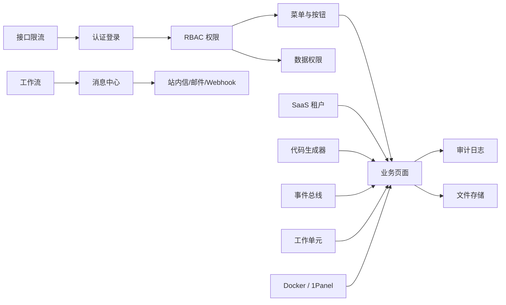

# 功能总览

MiniAdmin 的功能按平台能力组织，而不是按某个业务领域组织。这样二开时可以把平台能力复用到任何业务模块。

## 能力地图

## 功能清单

| 模块 | 能力 | 二开价值 |
| --- | --- | --- |
| 认证与 RBAC | 登录、JWT、用户、角色、菜单、按钮权限 | 所有后台模块的访问控制基础 |
| 组织与字典 | 部门、岗位、字典、参数 | 支撑人员组织和业务枚举 |
| SaaS 租户 | 租户、套餐、初始化、租户状态 | 支撑多租户后台和租户级授权 |
| 工作流审批 | 定义、发布、发起、审批、转办、撤回、催办、抄送 | 支撑合同、采购、报销等审批场景 |
| 消息中心 | 站内信、模板、策略、订阅、投递记录 | 支撑系统通知和业务通知 |
| 审计与安全 | 审计日志、实体变更、登录日志、安全中心 | 支撑合规、排障和追踪 |
| 监控与告警 | 系统监控、告警规则、计划任务 | 支撑运行态观察 |
| 文件存储 | 文件上传、下载、本地、MinIO | 支撑附件和业务文件 |
| 代码生成器 | CRUD 生成、菜单权限、产物治理 | 降低新增模块成本 |
| 架构扩展 | 本地事件总线、工作单元、分层应用服务 | 支撑领域事件、事务边界和二开扩展 |
| 安全防护 | 登录安全、接口限流、安全事件、在线会话 | 降低撞库、误操作和异常访问风险 |
| 部署交付 | Docker Compose、一键部署脚本、1Panel 服务器说明 | 降低开源体验和私有化部署门槛 |

## 功能截图

如果你想先看实际界面，可以直接阅读 [功能截图展示](./showcase.md)。截图由仓库内自动化脚本生成，便于开源展示和版本更新时刷新文档。

## 推荐使用方式

1. 平台能力保持通用，不写具体业务逻辑。
2. 新业务模块按独立菜单、独立权限、独立接口接入。
3. 需要审批时，通过业务绑定或工作流接口接入。
4. 需要通知时，通过消息中心模板和策略接入。
5. 需要审计时，复用审计中间件和实体变更记录。

## 当前不建议继续扩展的低频能力

如果没有明确业务需求，暂不建议增加：

- 复杂规则引擎。
- 工作流统计大屏。
- 加签、会签、委托代理等低频流程能力。
- 过早的多数据库隔离。
- 与具体业务强绑定的平台代码。
