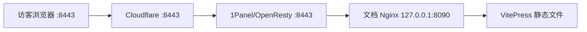

# 文档站部署到 1Panel 与 Cloudflare

MiniAdmin 文档站是 VitePress 生成的纯静态网站。推荐在开发机完成构建，把压缩包和部署脚本上传到服务器，由独立 Nginx 容器监听 `127.0.0.1:8090`，再通过 1Panel/OpenResty 提供域名和 HTTPS。

## 推荐拓扑



公网地址始终使用 `https://docs.example.com`，不要访问 `https://docs.example.com:8090`。Cloudflare 橙色云不支持直接代理 8090，因此 8090 只作为服务器内部源站端口。

## 1. 在开发机生成部署包

在 Windows 开发机的仓库根目录执行：

```powershell
powershell -ExecutionPolicy Bypass -File scripts/package-docs.ps1
```

脚本会执行 VitePress 构建，并在 `artifacts/docs` 生成两个文件：

```text
mini-admin-docs-<commit>.tar.gz
deploy-mini-admin-docs.sh
```

如果依赖尚未安装，先执行：

```powershell
pnpm --dir docs-site install --frozen-lockfile
```

压缩包根目录直接包含 `index.html`、`404.html`、`assets` 和各文档目录，不会多套一层 `dist`。

## 2. 上传并在终端部署

在 1Panel 的文件管理中创建目录，例如 `/root/mini-admin-docs-upload`，把上面的两个文件上传到该目录。也可以使用 `scp`：

```bash
scp deploy-mini-admin-docs.sh mini-admin-docs-*.tar.gz root@服务器IP:/root/mini-admin-docs-upload/
```

登录服务器后执行：

```bash
cd /root/mini-admin-docs-upload
bash deploy-mini-admin-docs.sh --domain docs.example.com
```

脚本默认完成以下工作：

- 自动选择当前目录最新的 `mini-admin-docs-*.tar.gz`。
- 校验压缩包和路径安全，拒绝目录穿越及链接文件。
- 解压到 `/opt/mini-admin-docs/releases/<版本>`，保留上一版本。
- 使用 `nginx:1.27-alpine` 启动 `mini-admin-docs-site` 容器。
- 只监听 `127.0.0.1:8090`，不直接开放公网端口。
- 执行 Nginx 配置检查和 HTTP 健康检查；失败时恢复上一版本。

### 推荐：自动创建站点和证书

脚本会自动识别 1Panel V2 或 V1 API，并使用对应的接口、签名算法和请求字段，自动完成反向代理网站和 HTTPS 绑定。它会优先查找覆盖目标域名且尚未过期的现有证书；找到后直接复用，不再申请证书，也不要求 Cloudflare Token。没有可用证书时，才创建 Cloudflare DNS 与 Let's Encrypt ACME 账户并申请新证书。首次执行前准备相应的最小权限凭证：

1. 在 1Panel 左下角用户菜单的 **API 接口** 中启用 API，IP 白名单加入 `127.0.0.1`，复制 API Key。
2. 仅在 1Panel 没有现成有效证书时，在 Cloudflare 的 **My Profile -> API Tokens** 使用 `Edit zone DNS` 模板创建 Token，确认包含 `Zone:Zone:Read` 和 `Zone:DNS:Edit`，并把资源范围限制到文档域名所在的单个 Zone。
3. 不要使用 Cloudflare Global API Key，也不要把任何 Token 写进脚本或提交到 Git。

> API Key、Token 或密码一旦出现在截图、聊天记录或公开日志中，应立即在对应平台重置，旧密钥不再继续使用。

脚本在 1Panel 所在服务器上运行时，会通过 `1pctl user-info` 自动读取协议和端口，通常不再需要填写 `--onepanel-url`：

```bash
cd /root/mini-admin-docs-upload
bash deploy-mini-admin-docs.sh \
  --domain docs.example.com \
  --auto-ssl \
  --acme-email ops@example.com \
  --cloudflare-email ops@example.com
```

脚本会先识别本机 1Panel 地址，再探测 `/api/v2` 并回退 `/api/v1`，同时隐藏提示输入 `1Panel API Key`。只有未找到现有有效证书时，才继续询问并校验 `Cloudflare API Token`。密钥不会出现在命令行参数或 shell history 中。若显式填写了文档站地址（例如 `http://127.0.0.1:8090`），脚本会识别这是文档端口并自动改用 1Panel 端口。

只有脚本不在 1Panel 所在服务器运行，或者无法执行 `1pctl` 时，才需要显式指定地址。如果远程 1Panel 使用自签证书的 HTTPS，可使用：

```bash
bash deploy-mini-admin-docs.sh \
  --domain docs.example.com \
  --auto-ssl \
  --acme-email ops@example.com \
  --cloudflare-email ops@example.com \
  --onepanel-url https://127.0.0.1:10086 \
  --onepanel-insecure
```

自动模式具有以下保护：

- 在停止或替换现有文档容器之前完成 1Panel API 版本和鉴权检查。
- 优先通过本机 `1pctl` 获取真实面板端口，防止把文档端口 `8090` 当成 1Panel API 端口。
- 优先复用覆盖目标域名的现有有效证书，包括精确域名和通配符证书；不存在时才校验 Cloudflare Token 并通过 DNS 验证签发证书。
- 默认让 1Panel 创建 HTTPS `8443` 站点，不绑定宿主机 `80/443`；如果 `8443` 已占用，则从 Cloudflare 支持的备用 HTTPS 端口中继续选择。
- 域名不存在时创建指向 `http://127.0.0.1:8090` 的 HTTPS 反向代理网站。
- 域名已被非反向代理网站占用时停止，不覆盖原网站。
- 现有代理目标不是当前文档站时停止，不静默修改代理地址。
- 复用现有证书时保留其原续签策略；新申请的证书开启自动续签。
- 证书申请失败时显示 1Panel 返回的错误，不输出 Cloudflare Token。

自动模式保留服务器上现有的 `80/443` 服务，MiniAdmin 文档站默认使用公网 HTTPS `8443`，访问地址需要显式携带端口，例如 `https://docs.example.com:8443`。Cloudflare 默认支持代理 `2053`、`2083`、`2087`、`2096` 和 `8443` 等 HTTPS 端口，但 `8443` 默认不参与 CDN 缓存；端口范围以 [Cloudflare 官方网络端口说明](https://developers.cloudflare.com/fundamentals/reference/network-ports/) 为准。

#### 与现有网站安全共享 443

如果 `https://docs.example.com:8443` 已正常，而无端口地址被服务器上的其他默认网站接管，可以运行配套修复脚本。HTTPS 不写端口时必然使用 `443`；该脚本不会替换 443 上的现有网站，而是通过 1Panel 域名管理接口，仅给文档网站增加 `docs.example.com:443` 绑定，由 OpenResty 按 SNI/Host 分流：

```bash
curl -fsSL https://gitee.com/baijincom/mini-admin/raw/main/repair-mini-admin-docs-default-https.sh \
  -o repair-mini-admin-docs-default-https.sh
chmod 700 repair-mini-admin-docs-default-https.sh
bash repair-mini-admin-docs-default-https.sh --domain docs.example.com
```

脚本会确认目标网站确实代理到 `127.0.0.1:8090`，检查是否已有 443 绑定，新增后通过本机 SNI 请求验证；验证失败时自动删除本次新增绑定。其他域名、sub2api 等已有网站不会被修改。

通常不需要指定 API 版本。如果自动探测结果与实际不符，可显式追加 `--onepanel-api-version v1` 或 `--onepanel-api-version v2`。

#### 1Panel API 排查

出现“无法识别 1Panel API”时，脚本会同时显示 V2、V1 的 HTTP 状态与 Content-Type。可在服务器执行以下不包含密钥的命令：

```bash
1pctl version
1pctl user-info
date -Is
timedatectl status
```

- `404` 或 `text/html`：通常是 1Panel 协议、端口填错，或请求到了普通网站；`--onepanel-url` 不能包含安全入口路径。
- `401`、`403` 或 API 密钥错误：重置并重新复制 API Key，保存 API 配置，确认白名单包含 `127.0.0.1`。
- 时间戳错误：启用 NTP，同步服务器时间后重试。API Key 有效期是允许的请求时间偏差，不代表密钥只使用这么久。
- 服务器使用反向代理访问 1Panel 时，优先填写 `1pctl user-info` 显示的本机协议和端口，不要填写域名代理地址。

CI 或非交互终端可以通过环境变量传入密钥。建议先隐藏读取，再导出，避免密钥进入历史：

```bash
read -rsp 'Cloudflare Token: ' MINIADMIN_CLOUDFLARE_TOKEN && echo
read -rsp '1Panel API Key: ' MINIADMIN_1PANEL_API_KEY && echo
export MINIADMIN_CLOUDFLARE_TOKEN MINIADMIN_1PANEL_API_KEY

bash deploy-mini-admin-docs.sh \
  --domain docs.example.com \
  --auto-ssl \
  --acme-email ops@example.com \
  --cloudflare-email ops@example.com

unset MINIADMIN_CLOUDFLARE_TOKEN MINIADMIN_1PANEL_API_KEY
```

指定压缩包或端口的示例：

```bash
bash deploy-mini-admin-docs.sh \
  --domain docs.example.com \
  --archive /root/mini-admin-docs-upload/mini-admin-docs-abc123.tar.gz \
  --port 8090
```

国内服务器无法拉取 Docker Hub 时，可以指定可访问的 Nginx 镜像：

```bash
MINIADMIN_DOCS_IMAGE=你的镜像仓库/nginx:1.27-alpine \
  bash deploy-mini-admin-docs.sh --domain docs.example.com
```

部署完成后检查：

```bash
curl -I http://127.0.0.1:8090/
curl -I http://127.0.0.1:8090/guide/introduction
docker ps --filter name=mini-admin-docs-site
docker logs --tail=100 mini-admin-docs-site
```

首页和文档地址应返回 `200`。无需在服务器防火墙中放行 8090。

## 3. 在 1Panel 创建反向代理网站（手动模式）

使用了 `--auto-ssl` 时跳过本节；脚本已经创建并检查反向代理网站。

进入 **网站 -> 网站 -> 创建网站**：

1. 类型选择 `反向代理`。
2. 主域名填写真实域名，例如 `docs.example.com`。
3. 代理地址填写 `http://127.0.0.1:8090`。
4. 其他选项保持默认并创建网站。

如果当前 1Panel 版本需要先创建网站再配置代理，则创建网站后进入 **反向代理 -> 添加反向代理**，目标 URL 同样填写：

```text
http://127.0.0.1:8090
```

不要把代理地址写成公网 IP，也不要给上游地址添加 HTTPS。TLS 在 1Panel/OpenResty 和 Cloudflare 层终止，内部 8090 使用 HTTP 即可。

先在服务器验证 1Panel 转发链路：

```bash
curl -I -H 'Host: docs.example.com' http://127.0.0.1/
```

如果返回 `502`，先确认容器健康，再检查代理地址是否准确：

```bash
curl -I http://127.0.0.1:8090/health
docker inspect --format '{{json .State.Health}}' mini-admin-docs-site
```

## 4. 在 Cloudflare 添加 DNS

在 Cloudflare 的 DNS 中添加记录：

| 类型 | 名称 | 内容 | 代理状态 |
| --- | --- | --- | --- |
| `A` | `docs` | 服务器公网 IP | DNS 验证模式可直接开启橙色云 |

域名在其他 DNS 服务商管理时，需要先把域名的 NS 服务器改成 Cloudflare 分配的地址。等待 DNS 生效后可检查：

```bash
nslookup docs.example.com
```

解析结果应为服务器公网 IP，开启橙色云后通常会显示 Cloudflare 的代理 IP。

## 5. 配置 HTTPS（手动模式）

使用了 `--auto-ssl` 时，证书申请、自动续签和仅 HTTPS 绑定均已完成；源站不会占用 `80/443`。确认 Cloudflare 为 `Full (strict)`，并使用带端口的地址访问，例如 `https://docs.example.com:8443`。

在 1Panel 网站的 **HTTPS** 页面配置证书，两种方式任选一种：

1. 使用 Let's Encrypt，通过 Cloudflare DNS API 完成 DNS 验证。
2. 在 Cloudflare 创建 Origin Certificate，把证书和私钥导入 1Panel。

配置后：

1. 启用 HTTPS。
2. 不在源站启用占用 `80` 的 HTTP 跳转；需要无端口入口时使用 Cloudflare Redirect Rule 跳转到带 `:8443` 的地址。
3. 最低 TLS 版本选择 TLS 1.2。
4. 在 Cloudflare 开启橙色云。
5. Cloudflare **SSL/TLS 加密模式选择 `Full (strict)`**。

不要使用 `Flexible`，否则 Cloudflare 到源站不加密，并可能产生 HTTPS 重定向循环。

可以开启 Brotli、HTTP/2 和 HTTP/3。不要直接使用会跳到默认 `443` 的 `Always Use HTTPS`；如需从 `http://docs.example.com` 跳转，请创建 Cloudflare Redirect Rule，把目标明确设置为 `https://docs.example.com:8443`。`8443` 默认不参与 Cloudflare CDN 缓存。

相关官方资料：

- [1Panel API 接口与 HMAC-SHA256 鉴权](https://1panel.cn/docs/v2/dev_manual/api_manual/)
- [1Panel V1 API 与 MD5 鉴权](https://1panel.cn/docs/v1/dev_manual/api_manual/)
- [1Panel DNS 账号模式申请证书](https://1panel.cn/docs/v2/user_manual/websites/certificate_create/)
- [Cloudflare 创建最小权限 API Token](https://developers.cloudflare.com/fundamentals/api/get-started/create-token/)

## 6. 验收公网链路

从任意联网设备执行：

```bash
curl -I https://docs.example.com/
curl -I https://docs.example.com/guide/introduction
```

验收标准：

- 首页和无扩展名文档链接返回 `200`。
- HTTP 自动跳转 HTTPS。
- HTTPS 证书域名正确且浏览器无警告。
- 响应头通常包含 Cloudflare 的 `cf-ray`。
- 刷新文档内页不会返回 404。

## 7. 后续更新与回滚

文档更新后，在开发机重新执行：

```powershell
powershell -ExecutionPolicy Bypass -File scripts/package-docs.ps1
```

只需把新的压缩包上传到服务器，再次运行同一条命令：

```bash
cd /root/mini-admin-docs-upload
bash deploy-mini-admin-docs.sh --domain docs.example.com
```

脚本不会删除旧版本。当前版本链接和历史版本可通过以下命令查看：

```bash
readlink -f /opt/mini-admin-docs/current
ls -lah /opt/mini-admin-docs/releases
```

发布后仍看到旧页面时，在 Cloudflare 执行 **Purge Cache**，优先只清理对应 HTML URL；必要时再执行 `Purge Everything`。

## 8. 常用运维命令

```bash
# 查看状态
docker ps --filter name=mini-admin-docs-site

# 查看日志
docker logs --tail=100 -f mini-admin-docs-site

# 重启
docker restart mini-admin-docs-site

# 停止
docker stop mini-admin-docs-site

# 再次启动
docker start mini-admin-docs-site

# 检查内部源站
curl -I http://127.0.0.1:8090/health
```

## 常见问题

### 脚本提示 Docker 未运行

在 1Panel 的应用商店或容器管理中安装并启动 Docker，然后检查：

```bash
docker info
```

### 拉取 nginx 镜像超时

为 Docker 配置国内镜像加速，或通过 `MINIADMIN_DOCS_IMAGE` 指定服务器可访问的镜像仓库。脚本只在本地没有镜像或显式传入 `--pull` 时拉取。

### 证书申请提示 `AcmeAccountID required`

部分 1Panel V2 版本在创建 ACME 账户后会暂时返回占位 ID `0`。最新版部署脚本会重新查询持久化后的真实账户 ID，再继续申请证书。出现该错误时重新下载脚本并执行即可，不需要删除已经创建的 ACME 或 Cloudflare DNS 账户。

### Cloudflare 提示 `failed to find zone` 或 `zone could not be found`

Token 本身有效不代表它能访问目标 Zone。确认 Token 同时具备 `Zone:Zone:Read`、`Zone:DNS:Edit`，资源范围包含目标域名所属的根 Zone。最新版脚本会在调用 1Panel 签发前读取 Cloudflare Zone 列表并校验权限，不再反复触发已经失败的证书记录。

### Cloudflare 显示 521

源站备用 HTTPS 端口（默认 `8443`）未监听、防火墙未放行、1Panel OpenResty 未启动，或者 DNS 指向错误 IP。自动模式不要求源站 `80/443`，`8090` 也无需对公网放行。

### Cloudflare 显示 525 或 526

源站证书无效、域名不匹配或证书链不完整。确认 1Panel 已绑定正确证书，并保持 Cloudflare 为 `Full (strict)`。

### 首页正常，点击文档返回 404

脚本内置的 Nginx 已配置 `try_files $uri $uri.html $uri/`。如果 404 来自 1Panel，确认网站类型为反向代理，且代理目标是 `http://127.0.0.1:8090`，不要在 1Panel 额外覆盖 URI 路径。
