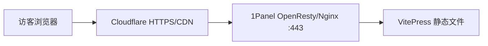

# 文档站部署到 1Panel 与 Cloudflare

MiniAdmin 文档站是 VitePress 生成的纯静态网站。生产环境推荐在本地构建，将产物上传到 1Panel，由 OpenResty/Nginx 直接读取文件；不需要启动 Node.js，也不需要 `proxy_pass` 到 VitePress 预览服务。

## 推荐拓扑



推荐使用独立子域名，例如 `docs.example.com`，并部署在域名根路径 `/`。如果必须使用 `example.com/docs/`，还需要修改 VitePress 的 `base` 配置，本文不采用这种方式。

## 1. 构建部署包

在 Windows 开发机的仓库根目录执行：

```powershell
powershell -ExecutionPolicy Bypass -File scripts/package-docs.ps1
```

脚本会先执行 `pnpm docs:build`，再生成：

```text
artifacts/docs/mini-admin-docs-<commit>.tar.gz
```

压缩包根目录直接包含 `index.html`、`404.html`、`assets` 和各文档目录，上传后不应再多套一层 `dist` 目录。

如果依赖尚未安装，先执行：

```powershell
pnpm --dir docs-site install --frozen-lockfile
```

## 2. Cloudflare 添加域名

在 Cloudflare 的 DNS 中添加记录：

| 类型 | 名称 | 内容 | 代理状态 |
| --- | --- | --- | --- |
| `A` | `docs` | 服务器公网 IP | 申请源站证书前可先关闭代理 |

两种证书方式任选一种：

1. 在 1Panel 使用 Let's Encrypt，并通过 Cloudflare DNS API 完成 DNS 验证。签发完成后开启橙色云代理。
2. 在 Cloudflare 创建 Origin Certificate，把证书和私钥导入 1Panel。此证书只用于 Cloudflare 到源站，关闭橙色云后浏览器不会直接信任它。

Cloudflare **SSL/TLS 加密模式必须选择 `Full (strict)`**。不要使用 `Flexible`，否则源站到 Cloudflare 不加密，并容易产生 HTTPS 重定向循环。

建议同时开启：

- Edge Certificates 中的 `Always Use HTTPS`。
- Brotli 压缩。
- HTTP/2 和 HTTP/3。

不要为所有路径配置长期 `Cache Everything`。VitePress 的带哈希静态资源可以长期缓存，但 HTML 应及时回源检查更新。

## 3. 1Panel 创建静态网站

进入 **网站 -> 网站 -> 创建网站**：

1. 类型选择 `静态网站`。
2. 主域名填写 `docs.example.com`。
3. 网站目录使用 1Panel 自动创建的目录即可。
4. PHP、数据库和反向代理都不需要配置。

创建后进入网站目录，删除默认的 `index.html`，上传 `mini-admin-docs-*.tar.gz` 并选择 **解压到当前目录**。

解压完成后，网站根目录必须类似：

```text
index.html
404.html
assets/
guide/
features/
developer/
runbooks/
```

如果看到 `dist/index.html` 或 `mini-admin-docs/index.html`，说明多了一层目录，需要把里面的内容移动到网站根目录。

## 4. Nginx 静态路由配置

1Panel 创建静态网站后已经生成 Nginx `server`，无需再监听其他应用端口。进入网站的 **配置 -> 配置文件**，找到现有的 `location /` 并替换为：

```nginx
error_page 404 /404.html;

location / {
    try_files $uri $uri.html $uri/ =404;
    add_header Cache-Control "no-cache, no-store, must-revalidate" always;
    add_header X-Content-Type-Options "nosniff" always;
    add_header Referrer-Policy "strict-origin-when-cross-origin" always;
}

location = /404.html {
    internal;
    add_header Cache-Control "no-cache, no-store, must-revalidate" always;
    add_header X-Content-Type-Options "nosniff" always;
    add_header Referrer-Policy "strict-origin-when-cross-origin" always;
}

location ~* \.(?:css|js|mjs|png|jpg|jpeg|gif|svg|ico|webp|woff2?)$ {
    try_files $uri =404;
    access_log off;
    add_header Cache-Control "public, max-age=2592000, immutable" always;
    add_header X-Content-Type-Options "nosniff" always;
    add_header Referrer-Policy "strict-origin-when-cross-origin" always;
}

location ~* \.html$ {
    try_files $uri =404;
    add_header Cache-Control "no-cache, no-store, must-revalidate" always;
    add_header X-Content-Type-Options "nosniff" always;
    add_header Referrer-Policy "strict-origin-when-cross-origin" always;
}
```

`try_files $uri $uri.html` 用来匹配 VitePress 的无扩展名链接，例如 `/guide/introduction` 实际读取 `guide/introduction.html`。

如果 1Panel 配置中已经存在图片、CSS 或 JavaScript 的正则 `location`，请删除旧块或与上面的缓存块合并，同一类规则只保留一份。保存配置时让 1Panel 执行语法检查。不要添加下面这种反向代理：

```nginx
# 不推荐：文档站不需要常驻 Node 进程
proxy_pass http://127.0.0.1:4173;
```

## 5. 1Panel 启用 HTTPS

进入网站的 **HTTPS**：

1. 选择已签发或已导入的证书。
2. 启用 HTTPS。
3. 启用 HTTP 跳转 HTTPS。
4. 最低 TLS 版本选择 TLS 1.2。

如果使用 Let's Encrypt HTTP 验证，可以先把 Cloudflare 记录改成灰色云，证书签发后再开启橙色云。使用 Cloudflare DNS API 验证则无需关闭代理。

## 6. 验证访问链路

先在服务器检查 Nginx 是否能直接找到静态文件：

```bash
curl -I -H 'Host: docs.example.com' http://127.0.0.1/
curl -I -H 'Host: docs.example.com' http://127.0.0.1/guide/introduction
```

再从任意联网设备检查 Cloudflare 链路：

```bash
curl -I https://docs.example.com/
curl -I https://docs.example.com/guide/introduction
```

预期结果：

- 首页和无扩展名文档链接返回 `200`。
- HTTP 请求重定向到 HTTPS。
- HTTPS 证书域名正确。
- 响应头通常能看到 Cloudflare 的 `cf-ray`。

## 7. 后续更新文档

本地重新打包：

```powershell
powershell -ExecutionPolicy Bypass -File scripts/package-docs.ps1
```

在 1Panel 备份或清空旧网站目录，再把新压缩包解压到网站根目录。不要删除 1Panel 生成的网站配置和证书，只替换静态文件。

VitePress 静态资源文件名带内容哈希，通常不需要清理资源缓存。发布后如果仍看到旧页面，在 Cloudflare 执行一次 **Purge Cache -> Purge Everything**，或只清理对应 HTML URL。

## 常见问题

### 首页正常，点击文档返回 404

确认 Nginx 的 `location /` 包含：

```nginx
try_files $uri $uri.html $uri/ =404;
```

### Cloudflare 显示 521

源站 80/443 未监听、防火墙未放行、1Panel OpenResty 未启动，或者 DNS 指向了错误 IP。先关闭橙色云并直接检查源站。

### Cloudflare 显示 525 或 526

源站证书无效、域名不匹配或证书链不完整。确认 1Panel 已绑定正确证书，并保持 Cloudflare 为 `Full (strict)`。

### 页面更新后仍显示旧内容

确认新文件已解压到网站根目录，再清理 Cloudflare HTML 缓存。不要给 HTML 设置 30 天强缓存。
