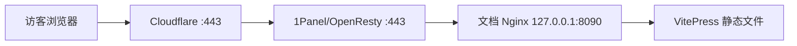

# 文档站部署到 1Panel 与 Cloudflare

MiniAdmin 文档站是 VitePress 生成的纯静态网站。推荐在开发机完成构建，把压缩包和部署脚本上传到服务器，由独立 Nginx 容器监听 `127.0.0.1:8090`，再通过 1Panel/OpenResty 提供域名和 HTTPS。

## 推荐拓扑



公网地址始终使用 `https://docs.example.com`，不要访问 `https://docs.example.com:8090`。Cloudflare 橙色云不支持直接代理 8090，因此 8090 只作为服务器内部源站端口。

## 1. 在开发机生成部署包

在 Windows 开发机的仓库根目录执行：

```powershell
powershell -ExecutionPolicy Bypass -File scripts/package-docs.ps1
```

脚本会执行 VitePress 构建，并在 `artifacts/docs` 生成两个文件：

```text
mini-admin-docs-<commit>.tar.gz
deploy-mini-admin-docs.sh
```

如果依赖尚未安装，先执行：

```powershell
pnpm --dir docs-site install --frozen-lockfile
```

压缩包根目录直接包含 `index.html`、`404.html`、`assets` 和各文档目录，不会多套一层 `dist`。

## 2. 上传并在终端部署

在 1Panel 的文件管理中创建目录，例如 `/root/mini-admin-docs-upload`，把上面的两个文件上传到该目录。也可以使用 `scp`：

```bash
scp deploy-mini-admin-docs.sh mini-admin-docs-*.tar.gz root@服务器IP:/root/mini-admin-docs-upload/
```

登录服务器后执行：

```bash
cd /root/mini-admin-docs-upload
bash deploy-mini-admin-docs.sh --domain docs.example.com
```

脚本默认完成以下工作：

- 自动选择当前目录最新的 `mini-admin-docs-*.tar.gz`。
- 校验压缩包和路径安全，拒绝目录穿越及链接文件。
- 解压到 `/opt/mini-admin-docs/releases/<版本>`，保留上一版本。
- 使用 `nginx:1.27-alpine` 启动 `mini-admin-docs-site` 容器。
- 只监听 `127.0.0.1:8090`，不直接开放公网端口。
- 执行 Nginx 配置检查和 HTTP 健康检查；失败时恢复上一版本。

指定压缩包或端口的示例：

```bash
bash deploy-mini-admin-docs.sh \
  --domain docs.example.com \
  --archive /root/mini-admin-docs-upload/mini-admin-docs-abc123.tar.gz \
  --port 8090
```

国内服务器无法拉取 Docker Hub 时，可以指定可访问的 Nginx 镜像：

```bash
MINIADMIN_DOCS_IMAGE=你的镜像仓库/nginx:1.27-alpine \
  bash deploy-mini-admin-docs.sh --domain docs.example.com
```

部署完成后检查：

```bash
curl -I http://127.0.0.1:8090/
curl -I http://127.0.0.1:8090/guide/introduction
docker ps --filter name=mini-admin-docs-site
docker logs --tail=100 mini-admin-docs-site
```

首页和文档地址应返回 `200`。无需在服务器防火墙中放行 8090。

## 3. 在 1Panel 创建反向代理网站

进入 **网站 -> 网站 -> 创建网站**：

1. 类型选择 `反向代理`。
2. 主域名填写真实域名，例如 `docs.example.com`。
3. 代理地址填写 `http://127.0.0.1:8090`。
4. 其他选项保持默认并创建网站。

如果当前 1Panel 版本需要先创建网站再配置代理，则创建网站后进入 **反向代理 -> 添加反向代理**，目标 URL 同样填写：

```text
http://127.0.0.1:8090
```

不要把代理地址写成公网 IP，也不要给上游地址添加 HTTPS。TLS 在 1Panel/OpenResty 和 Cloudflare 层终止，内部 8090 使用 HTTP 即可。

先在服务器验证 1Panel 转发链路：

```bash
curl -I -H 'Host: docs.example.com' http://127.0.0.1/
```

如果返回 `502`，先确认容器健康，再检查代理地址是否准确：

```bash
curl -I http://127.0.0.1:8090/health
docker inspect --format '{{json .State.Health}}' mini-admin-docs-site
```

## 4. 在 Cloudflare 添加 DNS

在 Cloudflare 的 DNS 中添加记录：

| 类型 | 名称 | 内容 | 代理状态 |
| --- | --- | --- | --- |
| `A` | `docs` | 服务器公网 IP | 申请源站证书前可先关闭代理 |

域名在其他 DNS 服务商管理时，需要先把域名的 NS 服务器改成 Cloudflare 分配的地址。等待 DNS 生效后可检查：

```bash
nslookup docs.example.com
```

解析结果应为服务器公网 IP，开启橙色云后通常会显示 Cloudflare 的代理 IP。

## 5. 配置 HTTPS

在 1Panel 网站的 **HTTPS** 页面配置证书，两种方式任选一种：

1. 使用 Let's Encrypt，通过 Cloudflare DNS API 完成 DNS 验证。
2. 在 Cloudflare 创建 Origin Certificate，把证书和私钥导入 1Panel。

配置后：

1. 启用 HTTPS。
2. 启用 HTTP 跳转 HTTPS。
3. 最低 TLS 版本选择 TLS 1.2。
4. 在 Cloudflare 开启橙色云。
5. Cloudflare **SSL/TLS 加密模式选择 `Full (strict)`**。

不要使用 `Flexible`，否则 Cloudflare 到源站不加密，并可能产生 HTTPS 重定向循环。

建议同时开启 Cloudflare 的 `Always Use HTTPS`、Brotli、HTTP/2 和 HTTP/3。不要对全部 HTML 使用长期 `Cache Everything`；带哈希的静态资源可以长期缓存，HTML 应及时回源检查更新。

## 6. 验收公网链路

从任意联网设备执行：

```bash
curl -I https://docs.example.com/
curl -I https://docs.example.com/guide/introduction
```

验收标准：

- 首页和无扩展名文档链接返回 `200`。
- HTTP 自动跳转 HTTPS。
- HTTPS 证书域名正确且浏览器无警告。
- 响应头通常包含 Cloudflare 的 `cf-ray`。
- 刷新文档内页不会返回 404。

## 7. 后续更新与回滚

文档更新后，在开发机重新执行：

```powershell
powershell -ExecutionPolicy Bypass -File scripts/package-docs.ps1
```

只需把新的压缩包上传到服务器，再次运行同一条命令：

```bash
cd /root/mini-admin-docs-upload
bash deploy-mini-admin-docs.sh --domain docs.example.com
```

脚本不会删除旧版本。当前版本链接和历史版本可通过以下命令查看：

```bash
readlink -f /opt/mini-admin-docs/current
ls -lah /opt/mini-admin-docs/releases
```

发布后仍看到旧页面时，在 Cloudflare 执行 **Purge Cache**，优先只清理对应 HTML URL；必要时再执行 `Purge Everything`。

## 8. 常用运维命令

```bash
# 查看状态
docker ps --filter name=mini-admin-docs-site

# 查看日志
docker logs --tail=100 -f mini-admin-docs-site

# 重启
docker restart mini-admin-docs-site

# 停止
docker stop mini-admin-docs-site

# 再次启动
docker start mini-admin-docs-site

# 检查内部源站
curl -I http://127.0.0.1:8090/health
```

## 常见问题

### 脚本提示 Docker 未运行

在 1Panel 的应用商店或容器管理中安装并启动 Docker，然后检查：

```bash
docker info
```

### 拉取 nginx 镜像超时

为 Docker 配置国内镜像加速，或通过 `MINIADMIN_DOCS_IMAGE` 指定服务器可访问的镜像仓库。脚本只在本地没有镜像或显式传入 `--pull` 时拉取。

### Cloudflare 显示 521

源站 80/443 未监听、防火墙未放行、1Panel OpenResty 未启动，或者 DNS 指向错误 IP。8090 无需对公网放行。

### Cloudflare 显示 525 或 526

源站证书无效、域名不匹配或证书链不完整。确认 1Panel 已绑定正确证书，并保持 Cloudflare 为 `Full (strict)`。

### 首页正常，点击文档返回 404

脚本内置的 Nginx 已配置 `try_files $uri $uri.html $uri/`。如果 404 来自 1Panel，确认网站类型为反向代理，且代理目标是 `http://127.0.0.1:8090`，不要在 1Panel 额外覆盖 URI 路径。
