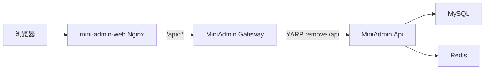
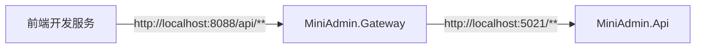
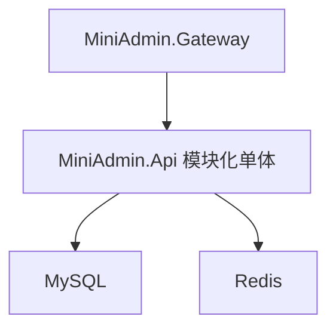

# 网关与微服务演进

MiniAdmin 已提供独立的 `MiniAdmin.Gateway` 网关项目。当前阶段推荐把它作为统一入口和入口治理层使用，不急着把核心业务拆成多个服务。

## 当前定位

`MiniAdmin.Gateway` 的职责很克制：

| 能力 | 当前实现 | 说明 |
| --- | --- | --- |
| 反向代理 | YARP | 将 `/api/**` 转发到后端 API |
| 路径整理 | `PathRemovePrefix=/api` | 前端继续访问 `/api/auth/login`，后端仍接收 `/auth/login` |
| 健康检查 | `/health` | 用于 Docker、1Panel、反向代理探活 |
| 入口限流 | ASP.NET Core RateLimiter | 网关层做全局限流和登录限流 |
| 灰度发布 | 稳定哈希 + 自定义负载策略 | 支持百分比、白名单、租户、用户、IP 和请求头 |
| 请求追踪 | `X-Trace-Id` | 生成或透传追踪 ID，并在响应中返回 |
| 熔断保护 | Closed/Open/HalfOpen | 上游连续失败时快速失败并自动探测恢复 |
| 转发头 | `X-Forwarded-*` | 保留真实来源 IP、Host 和协议 |
| CORS | 本地开发允许 `localhost` 和 `127.0.0.1` | 方便前端开发模式直连网关 |

网关不做业务认证、不查数据库、不直接访问租户、角色、流程等业务表。认证授权仍在 `MiniAdmin.Api` 中完成，这样能保证现有功能不被入口层改动影响。

## 请求链路

Docker Compose 默认链路如下：



本地开发时可以只启动 API 和网关：



## 本地启动

先启动后端 API：

```powershell
dotnet run --project src/MiniAdmin.Api/MiniAdmin.Api.csproj --urls http://localhost:5021
```

再启动网关：

```powershell
dotnet run --project src/MiniAdmin.Gateway/MiniAdmin.Gateway.csproj --urls http://localhost:8088
```

检查网关自身健康：

```powershell
Invoke-WebRequest -Uri http://localhost:8088/health -UseBasicParsing
```

检查网关代理到 API：

```powershell
Invoke-WebRequest -Uri http://localhost:8088/api/health -UseBasicParsing
```

默认上游配置在 `src/MiniAdmin.Gateway/appsettings.json`：

```json
{
  "ReverseProxy": {
    "Clusters": {
      "miniadmin_api": {
        "Destinations": {
          "stable": {
            "Address": "http://localhost:5021/"
          },
          "canary": {
            "Address": "http://localhost:5021/"
          }
        }
      }
    }
  }
}
```

如果你的 API 端口不是 `5021`，可以用环境变量覆盖：

```powershell
$env:ReverseProxy__Clusters__miniadmin_api__Destinations__stable__Address = "http://localhost:5022/"
$env:ReverseProxy__Clusters__miniadmin_api__Destinations__canary__Address = "http://localhost:5022/"
dotnet run --project src/MiniAdmin.Gateway/MiniAdmin.Gateway.csproj --urls http://localhost:8088
```

`/.well-known/**` 和 `/connect/**` 也会原样代理到 API，供 OAuth2/OIDC 客户端发现和换取令牌。

## Docker Compose 使用

Compose 已包含 `gateway` 服务。默认容器链路是：

```text
web -> gateway -> api -> mysql/redis
```

关键端口：

| 变量 | 默认值 | 说明 |
| --- | --- | --- |
| `MINIADMIN_WEB_PORT` | `5666` | 前端访问入口 |
| `MINIADMIN_GATEWAY_PORT` | `8088` | 网关健康检查和外部 API 入口 |
| `MINIADMIN_HTTP_PORT` | `8080` | API 直连端口，调试和健康检查使用 |

启动：

```powershell
Copy-Item .env.example .env
docker compose up -d --build
```

访问：

```text
前端：http://localhost:5666
网关健康：http://localhost:8088/health
API 代理：http://localhost:8088/api/health
API 直连：http://localhost:8080/health
```

生产或 1Panel 部署时，推荐只把前端端口暴露给公网，API 和网关端口绑定到服务器本机或内网，再由 Nginx、1Panel 网站或负载均衡统一转发。

## 网关限流

网关使用 `RateLimiting` 配置节，和 API 内部限流是两层保护：

| 配置项 | 默认值 | 说明 |
| --- | ---: | --- |
| `RateLimiting:Enabled` | `true` | 是否启用网关限流 |
| `RateLimiting:PermitLimit` | `1200` | 全局每个调用方在窗口期内允许的请求数 |
| `RateLimiting:WindowSeconds` | `60` | 全局固定窗口秒数 |
| `RateLimiting:QueueLimit` | `0` | 全局排队数量，默认不排队 |
| `RateLimiting:LoginPermitLimit` | `20` | 登录接口每个 IP 在窗口期内允许的请求数 |
| `RateLimiting:LoginWindowSeconds` | `60` | 登录接口固定窗口秒数 |
| `RateLimiting:LoginQueueLimit` | `0` | 登录接口排队数量，默认不排队 |

Docker 环境可通过 `.env` 调整：

```text
MINIADMIN_GATEWAY_RATE_LIMITING_ENABLED=true
MINIADMIN_GATEWAY_RATE_LIMITING_PERMIT_LIMIT=1200
MINIADMIN_GATEWAY_RATE_LIMITING_WINDOW_SECONDS=60
MINIADMIN_GATEWAY_LOGIN_RATE_LIMITING_PERMIT_LIMIT=20
MINIADMIN_GATEWAY_LOGIN_RATE_LIMITING_WINDOW_SECONDS=60
```

触发限流时，网关返回 `HTTP 429` 和统一 JSON：

```json
{
  "code": 429,
  "message": "请求过于频繁，请稍后再试。",
  "data": null
}
```

## 灰度发布、追踪与熔断

默认灰度关闭，`stable` 和 `canary` 都指向同一个 API，不会改变单实例部署。准备好灰度实例后配置：

```text
MINIADMIN_GATEWAY_CANARY_ENABLED=true
MINIADMIN_GATEWAY_CANARY_PERCENTAGE=10
MINIADMIN_CANARY_API_ADDRESS=http://mini-admin-api-canary:8080/
```

相同租户、用户或 IP 会通过稳定哈希持续命中同一发布通道；`X-Release-Channel: canary` 可强制进入灰度，白名单和自定义请求头规则可在 `Canary` 配置节中设置。响应包含 `X-Trace-Id`，便于关联网关与 API 日志。

熔断器默认按 Compose 配置启用，可通过以下变量调整：

```text
MINIADMIN_GATEWAY_CIRCUIT_BREAKER_ENABLED=true
MINIADMIN_GATEWAY_CIRCUIT_BREAKER_FAILURE_THRESHOLD=5
MINIADMIN_GATEWAY_CIRCUIT_BREAKER_BREAK_SECONDS=30
```

连接/转发失败或上游返回 `502/503/504` 达到阈值后，熔断器进入 Open 状态并快速返回 `503`；等待窗口结束进入 HalfOpen，探测成功后恢复 Closed。普通业务 `500` 不会打开整个 API 集群的熔断，避免单个业务缺陷扩散为全站不可用。它保护入口，不替代业务重试、幂等或跨服务补偿。

## 为什么现在不直接拆成微服务

MiniAdmin 目前的核心复杂度集中在认证、RBAC、租户、工作流、消息和审计之间的协作。过早拆分会带来这些成本：

- 本地开发需要同时启动更多服务。
- 调试一次审批或消息链路需要跨多个日志。
- 事务一致性要引入 Outbox、Inbox、重试和补偿。
- 权限、租户上下文和审计上下文要跨服务传递。
- 数据库边界变复杂，简单 CRUD 也会变成远程调用。

所以当前更推荐：网关先统一入口，后端保持模块化单体。等业务量、团队规模或部署隔离需求真的出现，再拆物理服务。

## 推荐拆分顺序

如果后续要走微服务，建议按风险从低到高拆：

| 阶段 | 可拆服务 | 理由 |
| --- | --- | --- |
| 1 | 通知服务 | 对主流程影响低，天然异步，适合事件驱动 |
| 2 | 文件服务 | 存储边界清晰，可独立扩容和限流 |
| 3 | 计划任务/运维服务 | 与在线请求链路耦合较低 |
| 4 | 业务模块服务 | 例如合同、采购、客户等独立业务域 |
| 5 | 工作流服务 | 规则复杂、上下文多，建议等模型稳定后再拆 |
| 6 | 认证与租户服务 | 平台核心，不建议早期拆 |

## 微服务落地前置能力

真正拆服务前，至少补齐这些工程能力：

- 服务注册或稳定的服务发现配置。
- 统一配置中心或环境变量治理。
- OpenTelemetry 链路追踪、指标和集中日志。
- 服务间认证，例如内部 JWT、mTLS 或网关内网访问控制。
- 分布式事件总线，例如 RabbitMQ、Kafka 或 Redis Stream。
- Outbox/Inbox，保证本地事务和跨服务事件一致性。
- API 版本治理，避免前端和服务之间强耦合升级。
- 数据库边界设计，明确哪些表属于哪个服务。

## 当前推荐实践

短期内保持下面的架构最稳：



新增业务模块时仍放在现有分层中：

- DTO 和接口放 `MiniAdmin.Application.Contracts`。
- 应用服务放 `MiniAdmin.Application`。
- 仓储、外部服务实现放 `MiniAdmin.Infrastructure`。
- 标准接口通过应用服务上的 Dynamic API 元数据暴露；文件流等传输细节放 `MiniAdmin.Api`。
- 页面、动态路由和权限通过 PageRegistry 注册。
- 需要对外统一入口时，通过 `MiniAdmin.Gateway` 暴露 `/api/**`。

这样既能满足开源项目的上手成本，也给将来的服务拆分留出了入口层。
