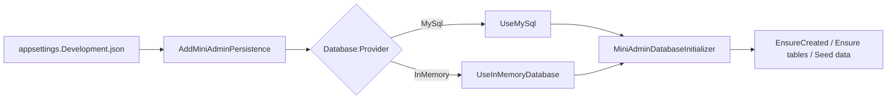

# MySQL 持久化需求文档

## 背景

项目需要连接用户自己的线上 MySQL，而不是只使用内存数据库。同时需要保留可扩展数据库提供者的能力，方便以后支持其他数据库。

## 目标

- 支持 `Database:Provider` 配置。
- 支持 MySQL 和 InMemory。
- 启动时自动初始化表和基础数据。
- 连接字符串只在配置文件中维护，不写入文档。

## 功能范围

- MySQL EF Core Provider。
- `MiniAdminDbContext`。
- 启动初始化器。
- 种子用户、角色、菜单、部门、字典、参数等基础数据。

## 不做范围

- 不引入 EF Migration 工作流。
- 不在文档中记录真实连接串。

## 数据流转

## 验收标准

- [x] 可以在配置中切换 MySQL / InMemory。
- [x] 启动时自动建表。
- [x] 初始化基础菜单和账号。
- [x] 测试可以使用 InMemory。
