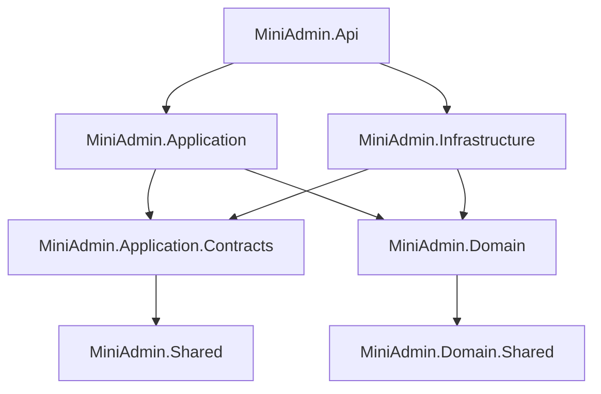

# 项目初始化与分层需求文档

## 背景

本项目目标是学习重建一个对标 yiabp-mini 的后台管理系统，并对接官方 Vben 前端。第一步需要建立清晰的 .NET 后端分层结构，方便后续逐步扩展认证、权限、系统管理和审计能力。

## 目标

- 创建 `MiniAdmin.slnx`。
- 建立 7 个后端项目。
- 统一目标框架为 `net10.0`。
- 明确各层职责和引用方向。

## 功能范围

- `MiniAdmin.Api`
- `MiniAdmin.Application`
- `MiniAdmin.Application.Contracts`
- `MiniAdmin.Domain`
- `MiniAdmin.Domain.Shared`
- `MiniAdmin.Infrastructure`
- `MiniAdmin.Shared`

## 不做范围

- 不实现具体业务功能。
- 不接入数据库。
- 不接入前端。

## 架构关系

## 验收标准

- [x] 解决方案存在。
- [x] 7 个项目存在。
- [x] 项目目标框架为 `net10.0`。
- [x] 分层职责清晰。
