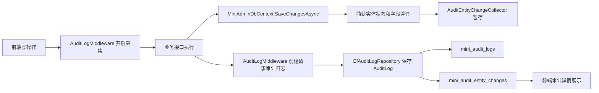

# 实体变更审计需求文档

## 背景

已有审计日志可以记录谁请求了哪个接口、请求体是什么、是否成功。但企业级后台还需要知道数据库里的数据到底发生了什么变化，例如用户部门变更、角色权限变更、菜单修改、字典项删除等。

## 目标

- 在写操作请求中记录实体新增、修改、删除。
- 保存修改前 JSON、修改后 JSON、字段差异 JSON。
- 审计日志详情页可以直接查看数据变更。
- 敏感字段不能泄露到审计日志中。

## 功能范围

- 捕获 EF Core `Added`、`Modified`、`Deleted` 实体。
- 新增实体变更表 `mini_audit_entity_changes`。
- 审计日志 DTO 返回 `EntityChanges`。
- 前端审计详情展示数据变更。

## 不做范围

- 不做字段中文名映射。
- 不做独立的数据变更查询页。
- 不做审计日志手动删除，仍按 90 天保留策略。

## 权限与安全

- 查看入口沿用审计日志权限：`system:log:query`。
- 导出仍沿用：`system:log:export`。
- `PasswordHash`、`SecurityStamp`、token、secret 等敏感字段统一脱敏为 `***`。
- 不记录审计日志自身、登录日志、在线用户等运行态实体，避免递归和噪声。

## 数据流转

## 验收标准

- [x] 修改用户后，审计日志中能看到 `User / Update`。
- [x] 能看到修改前、修改后、字段差异。
- [x] 敏感字段被脱敏。
- [x] MySQL 启动初始化能创建新表。
- [x] 前端构建通过。
