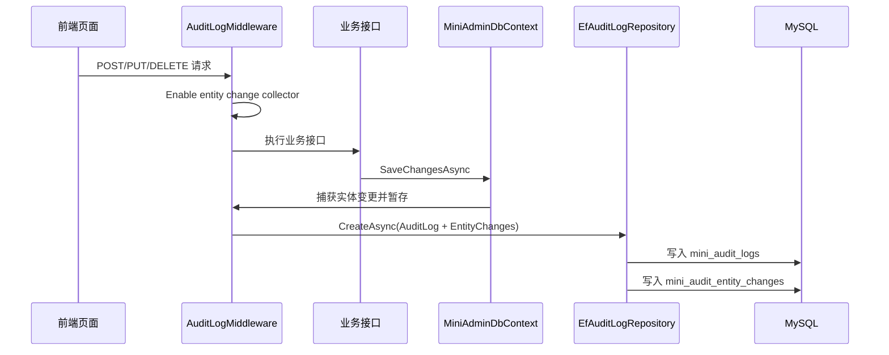

# 实体变更审计完工总结

## 完成内容

- 新增 `mini_audit_entity_changes` 表。
- 审计日志支持返回实体变更集合。
- 写操作期间自动捕获实体新增、修改、删除。
- 审计详情页新增“数据变更”区域。
- 敏感字段统一脱敏。

## 关键实现

- `AuditLogMiddleware` 控制一次请求内的采集生命周期。
- `MiniAdminDbContext.SaveChangesAsync` 统一捕获 EF Core 实体变化。
- `AuditEntityChangeCollector` 在请求作用域内暂存变化。
- `EfAuditLogRepository` 创建审计日志时一并保存实体变更。

## 数据流转



## 影响范围

- 后端审计日志 DTO 增加 `EntityChanges`。
- MySQL 增加 `mini_audit_entity_changes` 表。
- 前端审计详情展示更多信息。
- 所有系统管理写操作都会自动进入实体变更审计。

## 验证结果

```text
实体变更审计测试：通过
审计相关测试：5 passed
完整后端测试：62 passed
前端构建：pnpm run build:antd 通过
```

## 使用方式

进入 `系统管理 / 日志管理`，找到一次新增、修改或删除操作，点击“查看”。详情页下方的“数据变更”区域会展示实体类型、实体 ID、操作类型、修改前、修改后和字段差异。

## 后续建议

- 增加字段中文名映射，让非开发人员更容易阅读。
- 增加独立的数据变更查询页。
- 支持按实体类型、实体 ID 检索历史变化。
