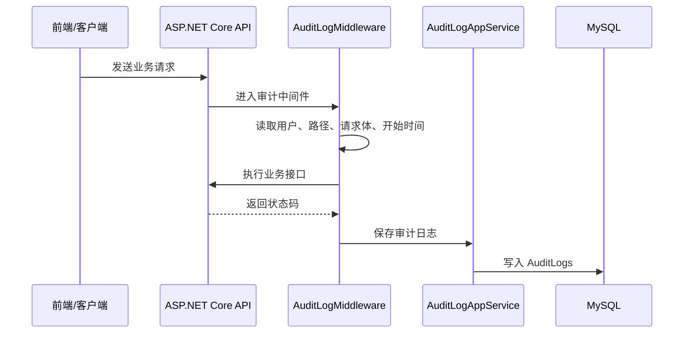

# 审计日志基础能力需求文档

> 回补整理。

## 背景

企业后台需要能追踪“谁在什么时候访问了什么接口、做了什么操作、结果如何”。后续实体变更审计已经能记录 before/after/diff，但基础审计日志负责记录请求级别的全流程入口。

## 目标

- 记录当前登录用户、请求路径、HTTP 方法、IP、User-Agent。
- 记录请求耗时、响应状态、是否成功。
- 记录请求体，便于追踪用户提交的数据。
- 提供审计日志列表查询。
- 支持导出审计日志。
- 日志保留 90 天，暂不提供手动删除。

## 功能范围

- 审计日志中间件。
- 审计日志实体和仓储。
- 审计日志分页查询接口。
- 审计日志导出接口。
- 前端审计日志页面。

## 安全要求

- 不记录密码、token 等敏感明文。
- 请求体记录要控制长度，避免超大 payload 影响数据库。
- 查询和导出需要权限码控制。

## 数据流转

## 验收标准

- [x] 登录和业务请求会写入审计日志。
- [x] 审计日志包含请求体。
- [x] 审计日志页面能分页查询。
- [x] 审计日志支持导出。
- [x] 保留策略为 90 天，不提供手动删除按钮。

