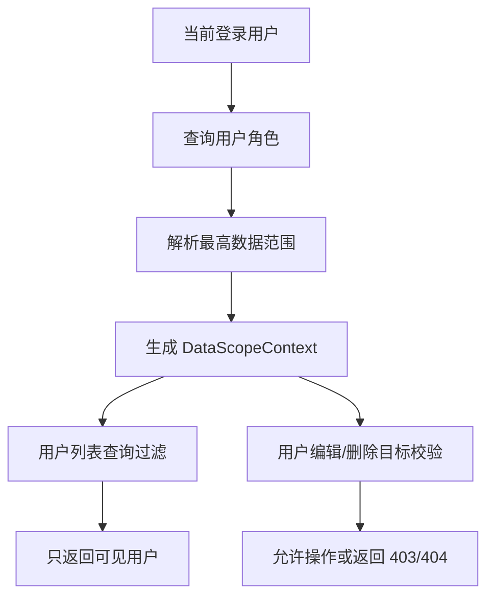

# 数据权限需求文档

> 回补整理。

## 背景

RBAC 解决“能不能访问某个功能”，但企业后台还需要解决“能看到哪些数据”。例如测试角色可以进入用户管理，但只能管理本部门用户，不能删除总部或其他部门账号。

## 目标

- 角色支持配置数据范围。
- 用户列表按当前用户数据范围过滤。
- 用户编辑、删除时校验目标用户是否在当前数据范围内。
- 权限不足时返回明确提示。
- admin 角色拥有全部数据权限。

## 数据范围

- `All`：全部数据。
- `Department`：当前用户所在部门。

后续可扩展：

- `DepartmentAndChildren`：本部门及子部门。
- `Self`：仅本人。
- `Custom`：自定义部门集合。

## 数据流转

## 验收标准

- [x] admin 可以查看和操作全部用户。
- [x] 部门数据权限用户只能看到本部门用户。
- [x] 部门数据权限用户不能删除其他部门用户。
- [x] 权限不足时不应先提示成功再提示失败。
- [x] 数据权限结果可在权限诊断中心查看。

