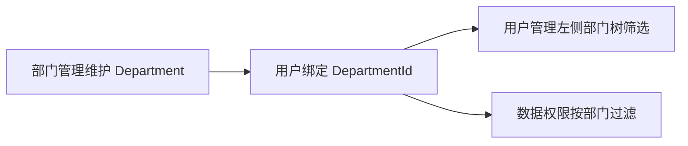

# 部门管理需求文档

> 回补整理。

## 背景

部门是组织架构、用户筛选和数据权限的基础。用户管理需要通过部门树筛选员工，数据权限也需要依赖当前用户所在部门进行范围判断。

## 目标

- 支持部门树形展示。
- 支持部门新增、编辑、删除。
- 支持父子部门结构。
- 用户可以绑定部门。
- 数据权限可以基于部门进行过滤。

## 功能范围

- 部门列表树查询。
- 部门新增、编辑、删除。
- 部门排序、状态、负责人、联系电话等基础信息。
- 用户管理页面复用部门树。

## 不做范围

- 不做复杂组织矩阵。
- 不做一个用户多部门兼职。
- 不做部门负责人审批流。

## 数据流转

## 验收标准

- [x] 部门管理页面能展示树形结构。
- [x] 能新增、编辑、删除部门。
- [x] 用户管理页面能加载同一棵部门树。
- [x] 用户绑定部门后列表展示部门名称。
- [x] 数据权限能使用用户部门进行过滤。

