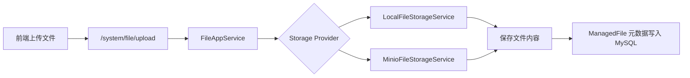

# 文件存储需求文档

> 回补整理。

## 背景

后台管理系统需要文件上传和下载能力。为了适配不同部署环境，需要同时支持本地存储和 MinIO，并通过配置切换。

## 目标

- 支持本地文件存储。
- 支持 MinIO 对象存储。
- 通过配置选择存储提供者。
- 上传后保存文件元数据到 MySQL。
- 支持文件列表、下载、删除。

## 功能范围

- 文件上传接口。
- 文件下载接口。
- 文件列表接口。
- 文件删除接口。
- 本地存储实现。
- MinIO 存储实现。
- 前端文件管理页面。

## 存储流转

## 验收标准

- [x] 本地存储模式可上传下载。
- [x] MinIO 配置后可切换使用。
- [x] 文件元数据写入 MySQL。
- [x] 文件列表能展示上传记录。
- [x] 删除文件会删除元数据并清理存储对象。

