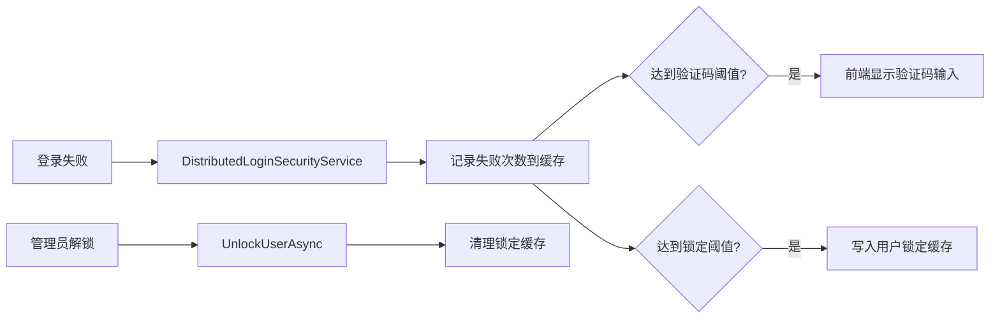

# 登录安全与账号锁定需求文档

## 背景

基础登录完成后，需要防止暴力破解，并支持管理员解锁被锁账号。用户多次登录失败后应出现验证码和锁定机制。

## 目标

- 多次登录失败后要求验证码。
- 超过失败次数后锁定账号一段时间。
- admin 角色用户可解锁其他用户。
- 用户列表展示登录锁定状态。

## 功能范围

- 验证码生成和校验。
- 登录失败计数。
- 登录锁定。
- 管理解锁。
- 用户列表登录状态展示。

## 不做范围

- 不接入短信验证码。
- 不做图形验证码复杂干扰线。
- 不做第三方认证。

## 数据流转

## 验收标准

- [x] 多次错误后提示验证码。
- [x] 锁定用户后无法登录。
- [x] 管理员可以解锁。
- [x] 用户列表能看到锁定状态和解锁按钮。
