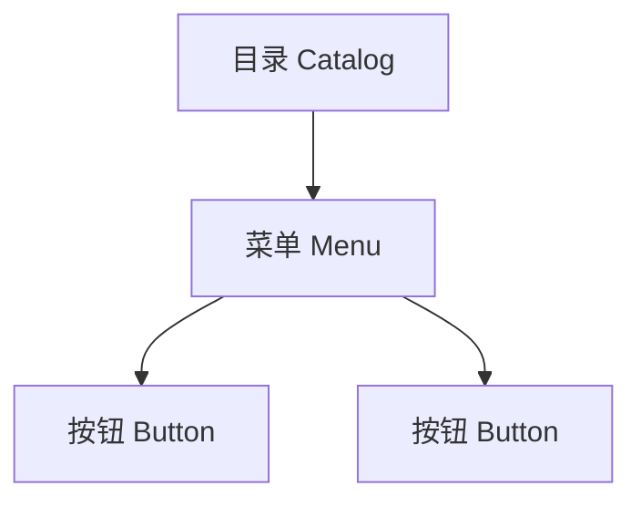

# 菜单管理 CRUD 需求文档

> 回补整理。

## 背景

菜单是 RBAC 的核心资源。系统需要允许管理员维护目录、菜单和按钮权限，并把它们同步给 Vben 路由和角色授权页面。

## 目标

- 支持菜单树查询。
- 支持菜单新增、编辑、删除。
- 支持目录、菜单、按钮三类资源。
- 支持配置路由名称、路径、组件、图标、排序、权限码。
- 支持角色分配页面使用同一棵菜单树。

## 功能范围

- 菜单管理页面。
- 菜单树接口。
- 菜单 CRUD 接口。
- 菜单种子初始化。
- 删除菜单前进行基础保护。

## 菜单结构

## 验收标准

- [x] 管理员能查看菜单树。
- [x] 管理员能新增、编辑、删除菜单。
- [x] 菜单可配置权限码。
- [x] 按钮权限可挂在菜单下。
- [x] 角色分配权限时能勾选菜单和按钮。

