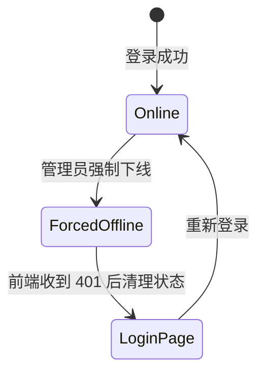

# 在线用户与强制下线需求文档

> 回补整理。

## 背景

管理员需要知道当前有哪些用户在线，并能在账号异常、权限调整或安全风险时强制用户下线。用户被强制下线后，前端应跳转到登录页，而不是一直转圈。

## 目标

- 登录成功后记录在线用户。
- 提供在线用户列表。
- 支持管理员强制下线指定用户。
- 被强制下线的 token 不再可用。
- 前端识别 401/强制下线后跳转登录页。

## 功能范围

- 登录日志记录。
- 在线用户记录。
- 在线用户查询。
- 强制下线接口。
- token 失效版本控制。
- 前端登录态失效处理。

## 状态流

## 验收标准

- [x] 登录后能在在线用户列表看到记录。
- [x] 管理员能强制用户下线。
- [x] 被强制下线用户刷新或请求后进入登录页。
- [x] 不出现长时间转圈卡住。

