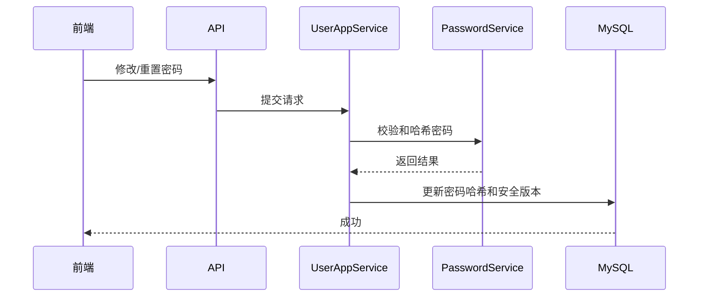

# 密码修改与重置需求文档

> 回补整理。

## 背景

后台系统需要同时支持用户自己修改密码，以及管理员为用户重置密码。密码变更后，旧 token 应失效，避免旧登录态继续使用。

## 目标

- 当前用户可以修改自己的密码。
- 修改密码需要校验旧密码。
- 管理员可以重置其他用户密码。
- 重置密码需要对应按钮权限。
- 密码变更后旧 token 失效。
- 密码策略给出明确错误提示。

## 功能范围

- 修改当前用户密码。
- 管理员重置用户密码。
- 密码策略校验。
- token 失效。
- 前端按钮权限控制。

## 安全流转

## 验收标准

- [x] 当前用户能修改密码。
- [x] 旧密码错误时不能修改。
- [x] 管理员有权限时能重置用户密码。
- [x] 没有重置密码权限时不能操作。
- [x] 密码变更后旧 token 失效。

