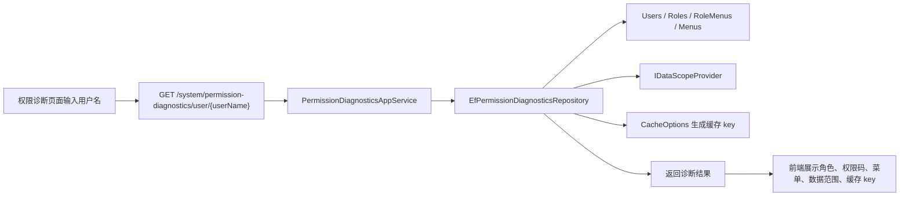

# 权限诊断中心需求文档

## 背景

RBAC、按钮权限、数据权限和缓存已经接入后，排查“为什么看不到菜单”、“为什么能删除”、“为什么 403/404”会变得复杂。需要一个诊断页面，把某个用户最终拥有的角色、权限码、菜单、数据范围和缓存键展示出来。

## 目标

- 通过用户名查询用户最终权限。
- 展示用户角色、权限码、菜单、按钮权限、数据范围。
- 展示 Redis/内存缓存 key，方便定位缓存问题。
- 支持管理员刷新某个用户授权缓存。

## 功能范围

- 新增 `系统管理 / 权限诊断` 菜单。
- 新增查询接口和刷新缓存接口。
- 新增权限码：
  - `system:permission-diagnostics:query`
  - `system:permission-diagnostics:refresh-cache`
- 前端新增诊断工作台页面。

## 不做范围

- 不做任意接口实时模拟鉴权。
- 不做单条业务数据可见性解释。
- 不做缓存内容直接读取展示，只展示缓存 key 和刷新动作。

## 权限与安全

- 查询权限诊断需要 `system:permission-diagnostics:query`。
- 刷新缓存需要 `system:permission-diagnostics:refresh-cache`。
- 页面只展示权限、菜单、角色和缓存 key，不展示密码、token 等敏感内容。

## 数据流转

## 验收标准

- [x] admin 能打开权限诊断菜单。
- [x] 查询 admin 能看到 admin 角色。
- [x] 能看到最终权限码。
- [x] 能看到菜单和按钮权限。
- [x] 能看到数据权限范围。
- [x] 能刷新指定用户授权缓存。
- [x] Redis 旧菜单缓存不会挡住新菜单。
