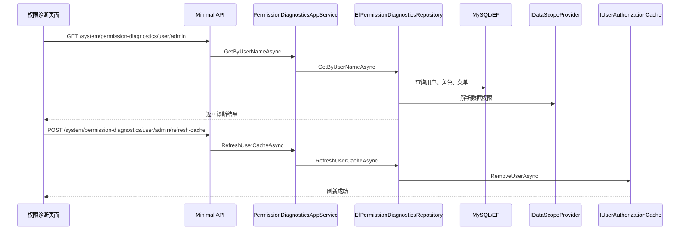

# 权限诊断中心完工总结

## 完成内容

- 新增 `系统管理 / 权限诊断` 页面。
- 支持按用户名查询权限诊断结果。
- 展示用户、角色、权限码、菜单、按钮权限、数据权限、缓存 key。
- 支持刷新指定用户授权缓存。
- 新增对应菜单权限和按钮权限。
- 启动初始化时刷新种子用户授权缓存，避免 Redis 旧菜单缓存影响新菜单显示。

## 关键实现

- `EfPermissionDiagnosticsRepository` 聚合用户、角色、菜单、数据权限和缓存配置。
- `IDataScopeProvider` 复用现有数据权限解析逻辑。
- `IUserAuthorizationCache.RemoveUserAsync` 用于刷新指定用户缓存。
- 前端页面将诊断信息拆分为用户、数据权限、缓存、角色、权限码、菜单、按钮权限几个区域。

## 数据流转



## 影响范围

- 新增后端接口：
  - `GET /system/permission-diagnostics/user/{userName}`
  - `POST /system/permission-diagnostics/user/{userName}/refresh-cache`
- 新增权限：
  - `system:permission-diagnostics:query`
  - `system:permission-diagnostics:refresh-cache`
- 新增前端页面：
  - `/system/permission-diagnostics`

## 验证结果

```text
权限诊断测试：2 passed
完整后端测试：64 passed
前端构建：pnpm run build:antd 通过
后端健康检查：http://localhost:5320/health 正常
```

## 使用方式

进入 `系统管理 / 权限诊断`，输入用户名，例如 `admin`、`demo`，点击查询。页面会展示该用户最终拥有的角色、权限码、菜单、按钮权限、数据权限范围和缓存 key。

如果刚调整过角色、菜单、权限，点击“刷新缓存”可以清理该用户的授权缓存，再重新登录或刷新页面验证权限结果。

## 后续建议

- 增加“接口权限模拟”，输入接口权限码判断用户是否命中。
- 增加“数据可见性模拟”，选择业务数据后解释为什么可见或不可见。
- 支持从用户列表跳转到权限诊断页面并自动带入用户名。
