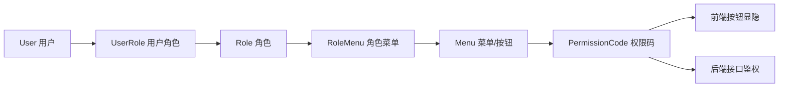

# RBAC 权限体系需求文档

> 回补整理：本功能已先完成实现，本文档用于沉淀当时的需求、边界和验收点。

## 背景

后台管理系统需要支持企业常见的“用户 - 角色 - 菜单 - 按钮权限”模型。前端 Vben 需要根据后端返回的菜单和权限码决定展示哪些页面、哪些按钮；后端接口也必须按权限码做二次校验，避免只隐藏按钮但接口仍可调用。

## 目标

- 用户可以绑定一个或多个角色。
- 角色可以分配菜单和按钮权限。
- 登录后返回用户角色、菜单和权限码。
- 前端根据权限码控制按钮显隐。
- 后端接口通过权限码校验访问权限。
- 修改用户角色或角色权限后，旧 token 和授权缓存要失效。

## 功能范围

- 角色 CRUD。
- 角色分配菜单和按钮权限。
- 用户绑定多角色。
- `/access/codes` 返回当前用户权限码。
- 菜单、按钮权限种子初始化。
- 后端接口使用 `RequirePermission` 或 `RequireAnyPermission` 保护。

## 不做范围

- 不做多租户隔离。
- 不做字段级权限。
- 不做审批流式授权。

## 权限模型

## 验收标准

- [x] admin 默认拥有全部系统管理权限。
- [x] test/demo 类角色可以只分配部分菜单和按钮。
- [x] 未分配的菜单刷新后不展示。
- [x] 未分配的按钮权限不会默认勾选。
- [x] 关闭删除权限后，前端不展示删除按钮，后端删除接口也拒绝。
- [x] 修改角色菜单后，相关用户旧 token 失效。

