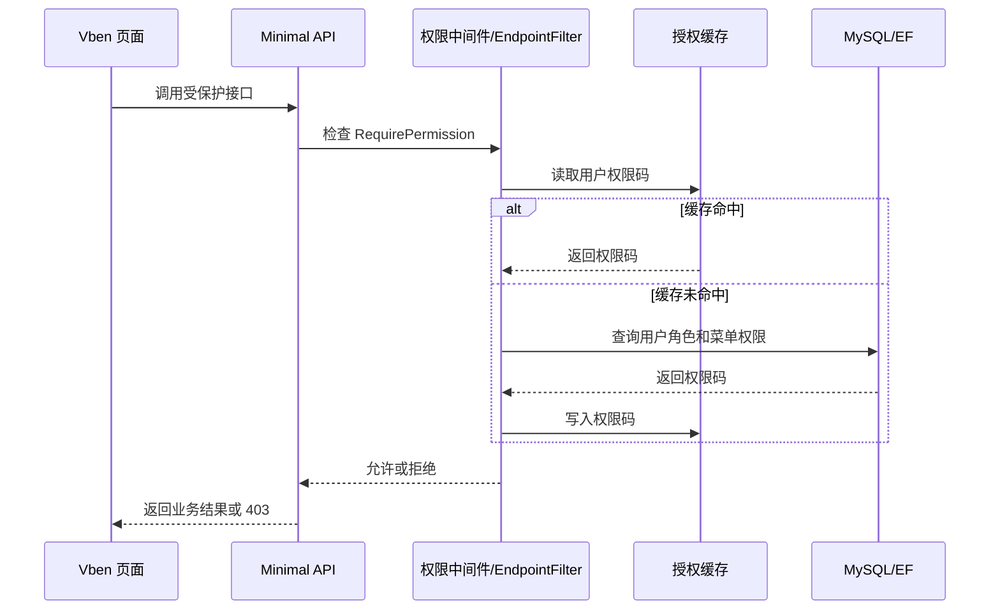

# RBAC 权限体系完工总结

## 完成内容

- 完成用户多角色、角色菜单、按钮权限的基础 RBAC。
- 完成角色管理页面和权限分配页面。
- 完成菜单权限与按钮权限的后端校验。
- 完成前端按钮显隐和后端接口权限双层保护。
- 修复“取消权限后再次分配仍默认勾选”的问题。
- 权限变更后会刷新缓存并让旧 token 失效，避免权限滞后。

## 关键实现

- `Menu.Type` 区分目录、菜单、按钮。
- `PermissionCode` 是前后端共同使用的权限标识。
- `RoleMenu` 保存角色拥有的菜单和按钮权限。
- `RequirePermission` 在 API 层做最终权限判断。
- `IUserAuthorizationCache` 缓存权限码，提升频繁鉴权性能。

## 权限流转

## 后续建议

- 后续可以增加接口级权限模拟工具。
- 可以在角色详情中展示“影响用户列表”。
- 可以增加权限变更审计，记录谁修改了哪个角色的哪些权限。

