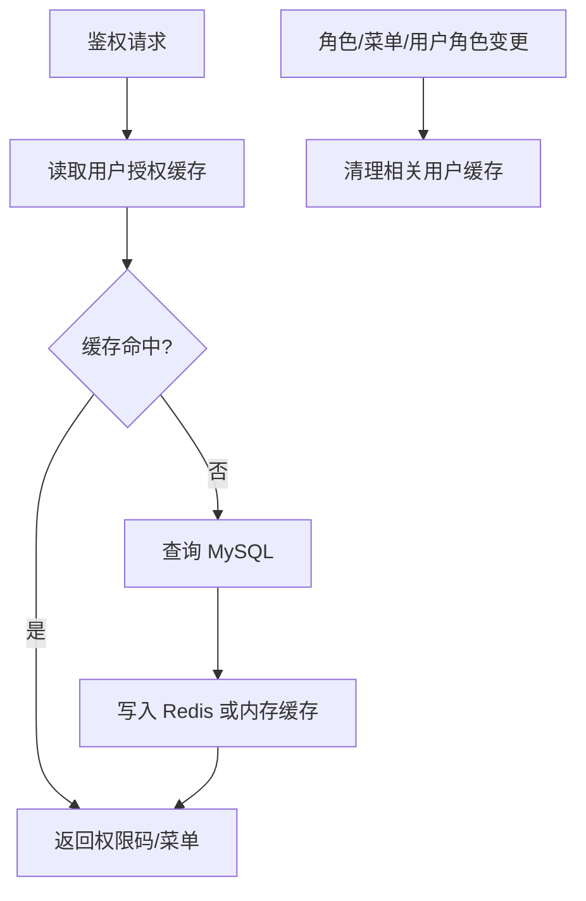

# Redis 授权缓存需求文档

> 回补整理。

## 背景

权限码、菜单、token 状态等数据会被频繁读取。为了提高性能，需要支持 Redis 缓存；但学习和本地开发阶段不能强依赖 Redis，所以没有配置 Redis 时要自动退回内存缓存。

## 目标

- 支持 Redis 缓存授权数据。
- 未配置 Redis 时使用内存缓存。
- 缓存权限码和动态菜单等高频授权数据。
- 修改用户角色、角色菜单后清理相关缓存。
- 权限诊断中心能展示缓存 key 并支持刷新。

## 功能范围

- 缓存配置。
- Redis 分布式缓存接入。
- 内存缓存 fallback。
- 用户权限码缓存。
- 用户菜单缓存。
- 缓存清理和诊断。

## 缓存流转

## 验收标准

- [x] 配置 Redis 后能写入授权缓存。
- [x] 不配置 Redis 时系统仍能正常运行。
- [x] 修改权限后旧缓存会被清理。
- [x] 强制下线和权限变更后旧 token 不继续生效。
- [x] 权限诊断中心能看到缓存 key。

