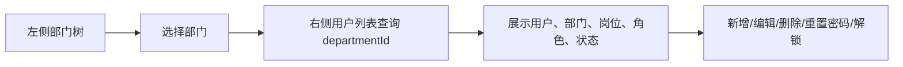

# 用户管理与部门树筛选需求文档

> 回补整理。

## 背景

用户列表在企业后台中通常不是单纯表格，而是左侧部门树、右侧用户表格。管理员先选择部门，再查看该部门下的员工账号，这样更符合组织管理习惯。

## 目标

- 用户列表支持按部门树筛选。
- 用户支持绑定部门、岗位、多个角色。
- 创建和编辑用户时可以选择部门、岗位、角色。
- 用户列表展示部门名称、岗位名称、角色名称。
- 删除用户时保护当前登录用户，避免删除自己导致会话异常。

## 功能范围

- 用户分页查询。
- 用户新增、编辑、删除。
- 用户部门筛选。
- 用户岗位筛选。
- 用户角色分配。
- 用户状态展示。
- 当前用户不能删除自己。

## 不做范围

- 不做用户导入导出。
- 不做头像上传。
- 不做复杂组织兼职。

## 页面布局

## 验收标准

- [x] 左侧能展示部门树。
- [x] 点击部门后右侧用户列表按部门刷新。
- [x] 用户创建时能绑定部门、岗位、角色。
- [x] 用户编辑时能修改部门、岗位、角色。
- [x] 用户不能删除自己。
- [x] 数据权限限制下不能删除其他部门用户。

