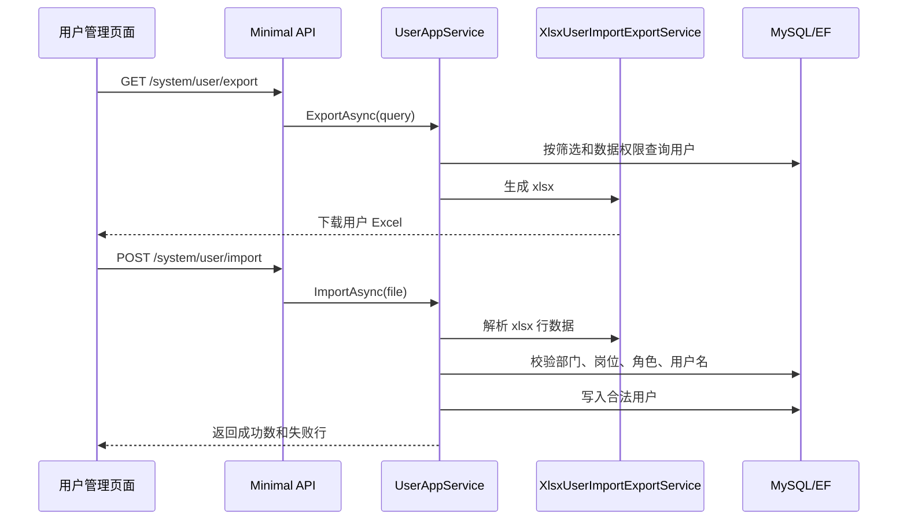

# 用户导入导出需求文档

## 背景

用户管理已经具备部门树、岗位、角色、数据权限、密码重置和账号锁定能力。企业实际使用时，初始化员工账号和批量核对账号信息都离不开 Excel 导入导出，因此下一步补齐用户导入导出。

## 目标

- 支持按当前筛选条件导出用户 Excel。
- 支持下载用户导入模板。
- 支持上传 Excel 批量创建用户。
- 导入时校验用户名、姓名、部门编码、岗位编码、角色编码、启用状态。
- 导入失败时返回行号和失败原因，不写入错误行。
- 导入成功后用户可按初始密码登录。
- 导入、导出都受 RBAC 权限控制。

## 功能范围

- 用户导出：导出当前用户列表筛选结果。
- 模板下载：提供标准表头和示例行。
- 用户导入：按模板读取 `.xlsx`，批量创建新用户。
- 权限码：
  - `system:user:export`
  - `system:user:import`
- 前端用户管理页面增加导入、导出按钮。

## 不做范围

- 不做更新已有用户，用户名已存在时返回失败。
- 不做异步导入任务和进度条。
- 不做百万级大文件导入。
- 不做复杂字段映射配置。

## Excel 字段

| 列名 | 必填 | 说明 |
| --- | --- | --- |
| 用户名 | 是 | 唯一账号，例如 `zhangsan` |
| 姓名 | 是 | 用户真实姓名 |
| 初始密码 | 是 | 新用户初始密码 |
| 部门编码 | 否 | 匹配部门管理中的 `Code` |
| 岗位编码 | 否 | 匹配岗位管理中的 `Code` |
| 角色编码 | 否 | 多个角色用英文逗号分隔，例如 `admin,test` |
| 启用状态 | 是 | `启用`、`停用`、`1`、`0` |

## 数据流转

## 验收标准

- [x] admin 能导出当前筛选条件下的用户 Excel。
- [x] admin 能下载导入模板。
- [x] admin 能通过模板导入新用户。
- [x] 用户名重复时返回失败行，不覆盖已有用户。
- [x] 部门、岗位、角色编码不存在时返回失败行。
- [x] 没有导入/导出权限时接口拒绝访问，前端按钮不展示。
- [x] 导入完成后列表能看到新用户。
