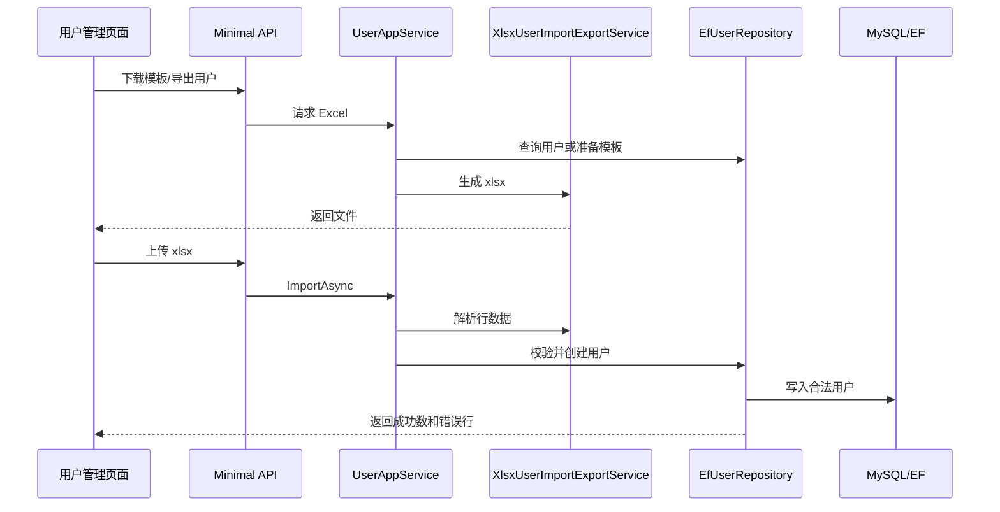

# 用户导入导出完工总结

## 完成内容

- 用户管理页面新增 `导出`、`下载模板`、`导入`。
- 后端新增用户 Excel 导出接口。
- 后端新增用户导入模板下载接口。
- 后端新增用户 Excel 导入接口。
- 导入支持校验用户名、姓名、初始密码、部门编码、岗位编码、角色编码、启用状态。
- 导入结果返回成功数量和失败行明细。
- 新增权限码：
  - `system:user:export`
  - `system:user:import`

## 关键实现

- `XlsxUserImportExportService` 使用 .NET 内置 zip 和 XML 能力生成/读取标准 `.xlsx`，避免新增第三方 Excel 依赖。
- `UserAppService` 负责导出行组装、模板生成、导入行解析。
- `EfUserRepository` 负责部门、岗位、角色、用户名唯一性和数据权限校验。
- 用户导入时只创建合法行，错误行返回行号和原因。
- Vben 页面通过 fetch 上传/下载文件，并复用当前 access token。

## 接口

- `GET /system/user/export`
- `GET /system/user/import-template`
- `POST /system/user/import`

## 数据流转



## 验证结果

```text
用户导入导出测试：2 passed
完整后端测试：66 passed
前端构建：pnpm run build:antd 通过
```

## 后续建议

- 增加导入失败明细 Excel 下载。
- 增加“更新已有用户”导入模式。
- 增加导入前预检查，只校验不落库。

