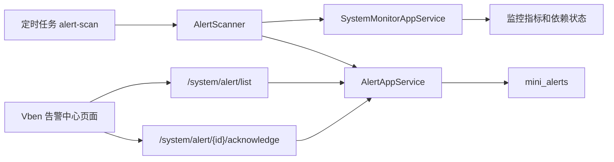

# 系统告警中心需求文档

## 背景

系统监控看板已经可以查看 API、MySQL、缓存、文件存储、CPU、内存、任务失败、异常文件等状态。下一步需要把“人工查看”升级为“系统主动发现并记录异常”，方便管理员追踪和处理问题。

## 目标

- 在 `系统监控` 菜单下新增 `告警中心`。
- 支持系统自动扫描关键指标并生成告警记录。
- 管理员可以查看告警列表、确认告警、查看处理状态。
- 告警数据需要持久化到 MySQL，并兼容当前 InMemory 测试。
- 告警扫描复用现有定时任务框架，避免额外引入任务调度框架。

## 第一版范围

### 告警来源

- `MemoryHigh`：系统物理内存使用率达到阈值。
- `DependencyUnhealthy`：MySQL、缓存、文件存储依赖异常。
- `ScheduledJobFailed`：近 24 小时存在失败的定时任务。
- `AuditFailureHigh`：近 24 小时存在失败操作日志。
- `AbnormalFileDetected`：存在异常文件。

### 告警记录字段

- 告警类型。
- 告警等级：`Info`、`Warning`、`Critical`。
- 标题。
- 内容。
- 来源。
- 状态：`Active`、`Acknowledged`、`Recovered`。
- 首次触发时间。
- 最近触发时间。
- 恢复时间。
- 确认人、确认时间、确认备注。
- 触发次数。

### 告警处理

- 管理员可以确认告警。
- 确认时可以填写备注。
- 同一个告警类型和来源如果仍未恢复，不重复新增记录，只更新最近触发时间和触发次数。
- 如果指标恢复，告警自动标记为 `Recovered`。

### 权限

- `system:alert:query`：查看告警。
- `system:alert:acknowledge`：确认告警。

## 不在第一版范围

- 用户自定义复杂规则表达式。
- 邮件、短信、企业微信、钉钉通知。
- 告警升级策略。
- 多租户告警隔离。

## 数据流

## 验收标准

- 登录 admin 后能在 `系统监控 > 告警中心` 看到菜单。
- `GET /system/alert/list` 能分页返回告警记录。
- `POST /system/alert/{id}/acknowledge` 能确认告警。
- 定时任务列表出现 `系统告警扫描`。
- 手动运行告警扫描任务后能写入任务日志。
- 后端测试通过。
- 前端构建通过。
