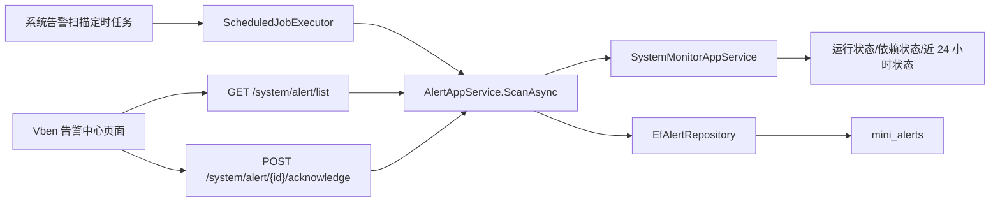

# 系统告警中心总结文档

## 本次完成

本次新增 `系统监控 > 告警中心`，将系统监控从“人工查看”推进到“自动扫描、记录、确认、恢复”的闭环。

后端新增：

- `GET /system/alert/list`
- `POST /system/alert/{id}/acknowledge`
- 权限：`system:alert:query`、`system:alert:acknowledge`
- 数据表：`mini_alerts`
- 定时任务：`alert-scan`，名称为 `系统告警扫描`

当前支持的告警类型：

- `MemoryHigh`：系统物理内存使用率过高。
- `DependencyUnhealthy`：MySQL、缓存、文件存储依赖异常。
- `ScheduledJobFailed`：近 24 小时存在失败定时任务。
- `AuditFailureHigh`：近 24 小时存在失败操作日志。
- `AbnormalFileDetected`：存在异常文件。

前端新增：

- `frontend/vue-vben-admin/apps/web-antd/src/api/system/alert.ts`
- `frontend/vue-vben-admin/apps/web-antd/src/views/system/alert/index.vue`

## 数据流

## 关键设计

- 同一个 `Type + Source` 的未恢复告警不会重复新增，而是更新最近触发时间和触发次数。
- 扫描时如果某类告警信号消失，对应未恢复告警会自动变为 `Recovered`。
- 管理员确认告警后状态变为 `Acknowledged`，并记录确认人、确认时间和备注。
- 规则先固定在系统资源、依赖和近 24 小时异常统计，暂不引入复杂规则引擎。

## 验证结果

- 告警中心过滤测试：通过，2/2。
- 后端完整测试：通过，81/81。
- Vben 前端构建：通过。

## 后续建议

下一步可以做“站内通知接入告警”：当产生新的 `Critical` 或 `Warning` 告警时，自动给管理员生成站内消息，并在右上角通知入口展示未读数量。
