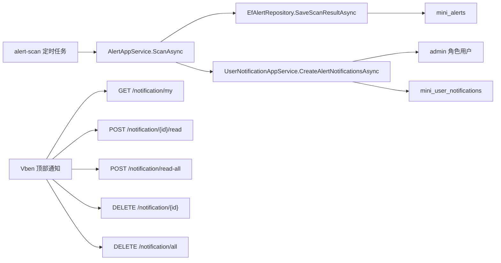

# 告警站内通知需求文档

## 背景

系统已经具备 `系统监控 > 告警中心`，可以通过定时任务扫描并记录系统告警。下一步需要让管理员在日常使用后台时能够主动看到告警提醒，而不是必须进入告警中心人工查看。

现有 `通知公告` 属于后台内容管理功能，适合发布全局公告，不适合承载“某个用户是否已读”的个人站内信。因此本阶段新增用户级站内通知。

## 目标

- 告警扫描产生新的 `Warning` 或 `Critical` 告警时，自动给 `admin` 角色下的启用用户生成站内通知。
- 顶部通知入口不再展示 Vben 示例假数据，而是读取当前登录用户的通知。
- 用户可以在顶部通知中完成读取、全部已读、删除单条、清空通知。
- 通知点击后跳转到 `/system/alert`，便于继续处理告警。
- 同一个告警只生成一次通知，避免定时扫描反复刷屏。

## 非目标

- 本阶段不做 WebSocket 实时推送，先采用登录后和页面刷新时拉取。
- 本阶段不做短信、邮件、企业微信等外部通知。
- 本阶段不做复杂通知规则配置，告警通知接收人固定为 `admin` 角色用户。

## 数据流

## 验收标准

- 运行 `alert-scan` 后，新产生的异常文件告警会给 admin 用户生成未读通知。
- 重复运行同一个告警扫描，不重复生成同一告警通知。
- `GET /notification/my` 返回当前用户通知列表和未读数量。
- `POST /notification/{id}/read` 可以标记单条已读。
- `POST /notification/read-all` 可以标记全部已读。
- `DELETE /notification/{id}` 可以删除单条通知。
- `DELETE /notification/all` 可以清空当前用户通知。
- 前端顶部通知入口展示真实数据，点击告警通知跳转告警中心。
