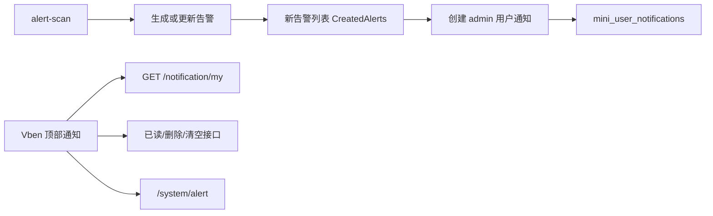

# 告警站内通知总结文档

## 完成内容

- 新增用户级站内通知表 `mini_user_notifications`，独立于通知公告 `mini_notices`。
- 告警扫描创建新的 `Warning` 或 `Critical` 告警后，会给启用的 `admin` 角色用户生成站内通知。
- 通过 `UserId + SourceType + SourceId` 唯一索引保证同一个告警不会重复刷通知。
- 新增当前用户通知接口：
  - `GET /notification/my`
  - `POST /notification/{id}/read`
  - `POST /notification/read-all`
  - `DELETE /notification/{id}`
  - `DELETE /notification/all`
- Vben 顶部通知入口已经从示例假数据改为真实接口数据。
- 顶部通知支持单条已读、全部已读、单条删除、清空通知和跳转告警中心。

## 关键实现

- 领域实体：`UserNotification`
- 应用契约：`IUserNotificationAppService`、`IUserNotificationRepository`
- 应用服务：`UserNotificationAppService`
- EF 仓储：`EfUserNotificationRepository`
- 告警接入点：`AlertAppService.ScanAsync`
- 前端 API：`apps/web-antd/src/api/core/notification.ts`
- 前端入口：`apps/web-antd/src/layouts/basic.vue`

## 数据流

## 验证结果

- `dotnet test tests/MiniAdmin.Tests/MiniAdmin.Tests.csproj --filter Notification ...`：通过 2 个测试。
- `dotnet test MiniAdmin.slnx ...`：通过 83 个测试。
- `dotnet build MiniAdmin.slnx`：通过，0 警告，0 错误。
- `pnpm run build:antd`：通过，Vben web-antd 构建完成。

## 后续建议

- 下一步可以做通知中心页面，提供全部通知查询、按已读状态筛选、按来源筛选。
- 后续如需实时提醒，可以在当前通知表基础上增加 SignalR 推送，不需要重做数据模型。
