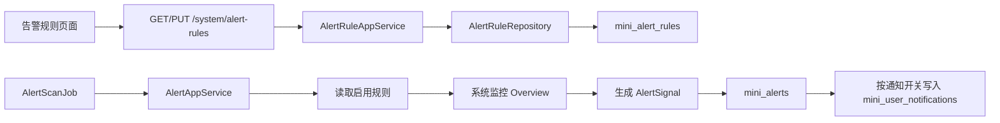

# 告警规则配置需求文档

## 背景

系统监控看板、告警中心和通知中心已经完成基础闭环，但告警判断条件仍写在代码中。企业级后台需要管理员能够按运行环境调整阈值、启停规则、控制通知，避免告警过多或遗漏重要风险。

## 目标

- 提供 `系统监控 / 告警规则` 页面。
- 支持内置告警规则的查询、编辑、启用、停用。
- 告警扫描根据数据库规则配置执行。
- 告警仍进入告警中心，通知是否创建由规则配置决定。
- 保留后续扩展成规则引擎的字段基础。

## 功能范围

- 新增 `mini_alert_rules` 表。
- 初始化 5 条系统内置规则：
  - `MemoryHigh`
  - `DependencyUnhealthy`
  - `ScheduledJobFailed`
  - `AuditFailureHigh`
  - `AbnormalFileDetected`
- 新增规则列表和更新接口。
- 新增 Vben 前端告警规则页面。
- 新增菜单和 RBAC 权限。
- 调整告警扫描逻辑，从硬编码阈值改为读取规则配置。

## 不做范围

- 不支持管理员新增自定义规则。
- 不支持删除系统内置规则。
- 不支持表达式编辑器。
- 不支持邮件、短信、Webhook 等外部通知渠道。
- 不支持多租户或部门级差异化规则。

## 权限与安全

- 菜单权限：`SystemMonitor > AlertRule`
- 查询权限：`system:alert-rule:query`
- 更新权限：`system:alert-rule:update`
- 接口必须走现有 JWT + RBAC 校验。
- 规则编码、名称、指标来源不允许前端修改，避免破坏系统内置规则语义。
- 本地敏感配置仍保留在 `appsettings.Development.json`，不进入 Git。

## 数据流转

## 验收标准

- [ ] 管理员可以在菜单中看到 `系统监控 / 告警规则`。
- [ ] 告警规则列表展示编码、名称、级别、阈值、统计窗口、启用状态、通知状态。
- [ ] 管理员可以编辑规则级别、阈值、统计窗口、启用状态、通知开关和备注。
- [ ] 关闭某条规则后，告警扫描不再生成该规则的告警。
- [ ] 关闭通知开关后，告警仍进入告警中心，但不创建通知中心消息。
- [ ] 无权限用户无法访问规则页面或更新接口。
- [ ] 后端测试通过，前端构建通过。
