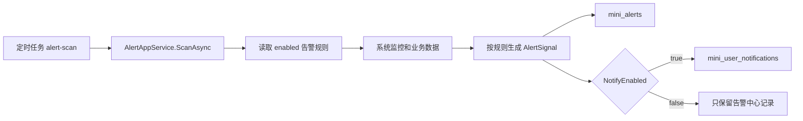

# 告警规则配置总结文档

## 完成内容

- 新增 `mini_alert_rules` 告警规则表和 `AlertRule` 实体。
- 初始化 5 条内置规则：内存过高、依赖异常、定时任务失败、审计失败过多、异常文件。
- 新增规则查询和更新接口：
  - `GET /system/alert-rule/list`
  - `PUT /system/alert-rule/{id}`
- 新增 RBAC 权限：
  - `system:alert-rule:query`
  - `system:alert-rule:update`
- 新增 Vben 页面 `系统监控 / 告警规则`，支持筛选、查看、编辑、启停和通知开关。
- 告警扫描改为读取启用规则，规则关闭时不生成告警，通知关闭时只生成告警不生成通知。
- 测试工厂固定为隔离的 `Testing` 配置，避免本地 MySQL/Redis 配置污染自动化测试。
- 新库初始化时不再默认授予 Admin 租户菜单，和当前系统取消租户菜单的目标保持一致。

## 关键设计

告警规则采用“内置规则可配置”的方式，而不是直接开放自定义表达式。这样可以先满足企业后台常见的阈值调整、启停、通知控制，又保留 `Code`、`Metric`、`Operator`、`Threshold`、`WindowMinutes` 这些字段，后续可以升级为更完整的规则引擎。



## 验证结果

```powershell
dotnet ef migrations has-pending-model-changes --project C:\monica\code\mini-admin\src\MiniAdmin.Infrastructure\MiniAdmin.Infrastructure.csproj --startup-project C:\monica\code\mini-admin\src\MiniAdmin.Api\MiniAdmin.Api.csproj --context MiniAdminDbContext
```

结果：无未迁移模型变化。

```powershell
dotnet test C:\monica\code\mini-admin\tests\MiniAdmin.Tests\MiniAdmin.Tests.csproj --filter "AlertRule|AlertScanJob|MenuAll|Cache_Uses|StorageConsistency|SystemUserList"
```

结果：20 个测试通过。

```powershell
dotnet test C:\monica\code\mini-admin\MiniAdmin.slnx
```

结果：88 个测试通过。

```powershell
pnpm run build:antd
```

结果：Vben `@vben/web-antd` 构建通过。

## 使用说明

管理员进入 `系统监控 / 告警规则` 后，可以编辑规则级别、阈值、统计窗口、启用状态、通知状态和备注。规则编码、规则名称、指标字段由系统维护，前端不开放修改。

## 后续建议

- 告警通知渠道扩展：站内信之外增加邮件、Webhook、企业微信等。
- 告警订阅人配置：不同规则可以通知不同角色或用户。
- 告警抑制策略：同一规则在短时间内重复触发时做静默或合并。
- 规则执行记录：记录每次扫描命中的规则和计算值，方便排查为什么触发告警。
