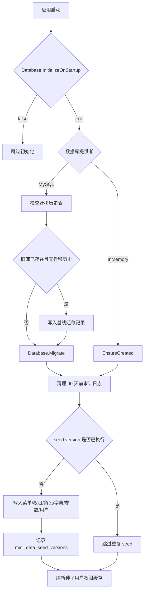

# 数据库迁移与初始化数据版本化需求文档

## 背景

当前项目已经接入 MySQL，并且系统管理模块逐步增多。学习阶段使用 `EnsureCreatedAsync()` 和少量 `CREATE TABLE IF NOT EXISTS` 可以快速跑起来，但企业项目需要把数据库结构变更变成可追踪、可回放、可升级的迁移记录。

同时，菜单、权限、角色、字典、参数、初始化用户等基础数据也需要版本化，避免每次启动都无差别重放，影响用户在页面中调整过的权限。

## 目标

- MySQL 使用 EF Core Migrations 管理表结构。
- InMemory 测试库继续使用 `EnsureCreatedAsync()`，保证测试简单稳定。
- 已经用旧方式创建过的 MySQL 库可以被迁移体系接管。
- 初始化数据写入版本表，确保同一批基础数据只应用一次。
- 保留启动时自动初始化能力，方便本地开发和学习。
- 为后续新增功能建立标准流程：改实体 -> 新增迁移 -> 新增 seed version -> 测试 -> 文档。

## 功能范围

- 新增迁移基线，用于描述当前已有表结构。
- 新增种子数据版本表 `mini_data_seed_versions`。
- 启动初始化拆分为：
  1. 数据库结构迁移。
  2. 运行维护任务，例如审计日志 90 天清理。
  3. 按版本执行基础数据初始化。
  4. 刷新初始化用户权限缓存。
- 增加配置项控制结构管理模式。
- 补充后端测试覆盖初始化行为。

## 不做范围

- 不做前端页面。
- 不直接改动用户的线上连接字符串。
- 不在本阶段新增业务表。
- 不做自动备份数据库。线上执行迁移前仍建议手动备份。

## 数据流转

## 验收标准

- [x] InMemory 初始化仍然能创建表并写入基础数据。
- [x] MySQL 配置下使用迁移而不是 `EnsureCreatedAsync()`。
- [x] 已存在旧 MySQL 表但没有迁移历史时，可以写入基线记录并继续执行后续迁移。
- [x] 初始化数据版本表能记录已应用版本。
- [x] 第二次启动不会重复执行同一批基础数据 seed。
- [x] 原有 90 天审计日志清理能力保留。
- [x] 后端完整测试通过。
