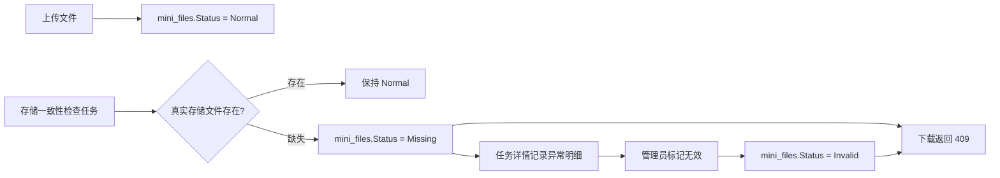

# 文件异常处理总结文档

## 本次完成

本次在文件管理和存储一致性检查之间补上了异常文件处置闭环：

- `ManagedFile` 增加 `Status` 字段，支持 `Normal / Missing / Invalid`。
- 新上传文件默认写入 `Normal`。
- 存储一致性检查发现真实文件缺失时，自动把文件状态标记为 `Missing`。
- 下载接口遇到 `Missing` 或 `Invalid` 文件返回 `409 Conflict`，避免继续下载异常资源。
- 新增 `system:file:mark-invalid` 权限，管理员可以把异常文件标记为 `Invalid`。
- 文件管理列表展示状态，并对异常文件禁用下载。
- 定时任务执行详情抽屉中可以直接对异常文件执行标记无效。
- 新增迁移 `20260528061341_AddManagedFileStatus`，给 `mini_files` 增加 `Status` 字段，既有数据默认 `Normal`。

## 数据流

## 使用入口

- 文件列表：`系统管理 > 文件管理`，查看状态、下载正常文件、标记异常文件无效。
- 定时任务：`系统监控 > 定时任务`，手动执行 `检查文件存储一致性`，在执行日志详情中处理异常文件。

## 验证结果

- 文件异常过滤测试：通过，2/2。
- 后端完整测试：通过，78/78。
- Vben 前端构建：通过，`@vben/web-antd` 构建成功。

## 后续建议

下一步可以继续做文件恢复能力：对 `Missing` 文件支持重新上传同一业务文件，状态从 `Missing/Invalid` 恢复为 `Normal`，并记录操作日志。
