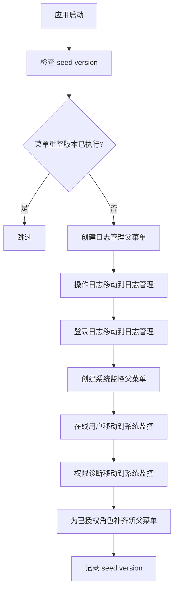

# 日志管理与系统监控菜单重整需求文档

## 背景

系统功能已经覆盖用户、角色、菜单、组织、审计、登录日志、在线用户、权限诊断等模块。随着功能增多，原来全部放在“系统管理”下会让菜单变长，也不利于后续继续扩展定时任务、服务健康、缓存状态等运行态功能。

当前“日志管理”实际是操作日志页面，“登录日志”又和它平级展示，语义不够清楚。在线用户和权限诊断更偏系统运行监控，也应该独立出来。

## 目标

- 新增一级菜单：日志管理。
- 日志管理下包含：操作日志、登录日志。
- 新增一级菜单：系统监控。
- 系统监控下包含：在线用户、权限诊断。
- 系统管理继续保留基础配置类功能。
- 保留已有菜单 ID、权限码和页面路径，尽量不破坏已有角色授权。
- 使用新的 seed version 落地本次结构调整。

## 目标菜单结构

```text
系统管理
├─ 用户管理
├─ 文件管理
├─ 角色管理
├─ 菜单管理
├─ 部门管理
├─ 岗位管理
├─ 字典管理
├─ 参数设置
├─ 通知公告

日志管理
├─ 操作日志
├─ 登录日志

系统监控
├─ 在线用户
├─ 权限诊断
```

## 不做范围

- 不新增定时任务页面，本阶段只为下一阶段准备菜单入口。
- 不改操作日志、登录日志、在线用户、权限诊断的接口。
- 不改已有权限码。
- 不删除租户相关占位菜单，只先从目标结构中移出，不作为本阶段重点。

## 数据流转



## 验收标准

- [x] `/menu/all` 返回一级菜单中包含 `LogManagement` 和 `SystemMonitor`。
- [x] `System` 下不再直接包含 `LogManagement`、`LoginLog`、`OnlineUser`、`PermissionDiagnostics`。
- [x] `LogManagement` 下包含 `OperationLog` 和 `LoginLog`。
- [x] `SystemMonitor` 下包含 `OnlineUser` 和 `PermissionDiagnostics`。
- [x] 操作日志页面路径仍为 `/system/log`。
- [x] 登录日志页面路径仍为 `/system/login-log`。
- [x] 在线用户页面路径仍为 `/system/online-user`。
- [x] 权限诊断页面路径仍为 `/system/permission-diagnostics`。
- [x] 后端完整测试通过。
