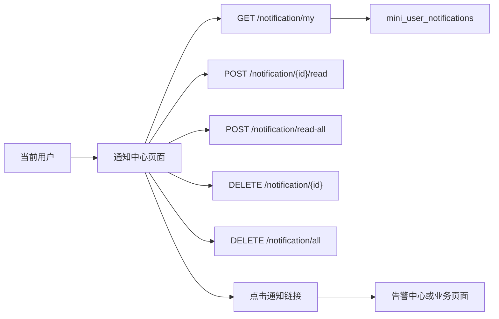

# 通知中心需求文档

## 背景

顶部通知铃铛已经接入真实站内通知，但它更适合作为快捷提醒入口。企业后台还需要一个完整的通知中心，用来查询历史通知、筛选未读消息，并批量处理个人通知。

## 目标

- 在 `系统监控` 菜单下新增 `通知中心` 页面。
- 当前用户可以分页查看自己的站内通知。
- 支持按已读状态、通知分类、来源类型筛选。
- 支持单条标记已读、单条删除、全部已读、清空通知。
- 顶部通知的“查看全部”跳转到通知中心。
- 通知中心只操作当前登录用户自己的通知，不提供跨用户管理能力。

## 非目标

- 本阶段不做 WebSocket 实时推送。
- 本阶段不做管理员代查其他用户通知。
- 本阶段不做通知规则配置。

## 数据流

## 验收标准

- `GET /notification/my?page=1&pageSize=10&isRead=false&category=SystemAlert` 可以返回筛选后的分页结果。
- `UnreadCount` 保持为当前用户所有未读通知数量，用于顶部铃铛红点。
- `系统监控` 菜单下出现 `通知中心`。
- Vben 前端可以进入 `/system/notification` 查看通知列表。
- 页面上的已读、全部已读、删除、清空操作会刷新列表和未读数量。
