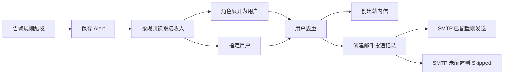

# 通知通道与接收人配置总结

## 完成内容

- 告警规则支持接收角色、指定用户、站内信开关和邮件开关。
- 新增 `mini_alert_rule_recipients` 保存规则接收人。
- 新增 `mini_notification_deliveries` 保存邮件投递结果。
- 用户资料新增邮箱字段，用户列表、新增、编辑页面已接入。
- 告警扫描按规则解析接收人，角色和指定用户会去重。
- 默认内置告警规则在无接收人时补 `admin` 角色。
- SMTP 配置放在 `Notifications:Email`，默认关闭；未配置时生成 `Skipped` 投递记录，不影响告警扫描。

## 数据流

## 验证结果

- `dotnet test tests/MiniAdmin.Tests/MiniAdmin.Tests.csproj --filter "NotificationRouting|AlertRule|AlertScanJob|UserEmail"`：通过 9 条。
- `dotnet ef migrations has-pending-model-changes`：无待迁移模型变更。
- `dotnet test MiniAdmin.slnx`：通过 91 条。
- `pnpm run build:antd`：通过。

## 使用说明

SMTP 配置在 `src/MiniAdmin.Api/appsettings.Development.json` 或环境变量中填写 `Notifications:Email`。开启 `Enabled` 且配置 `Host`、`FromEmail` 后才会尝试真实发送邮件。
