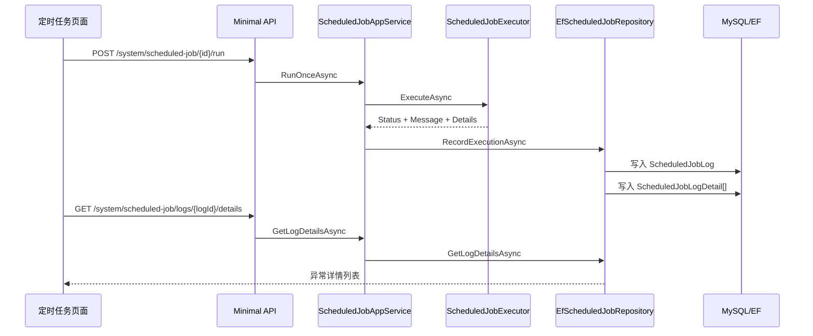

# 定时任务执行详情需求文档

## 背景

定时任务已经支持执行日志，但日志目前只有摘要信息。对于 `storage-consistency-check` 这类巡检任务，摘要只能说明“缺失几个文件”，不能定位到具体文件。

企业后台需要能够从一次任务执行追踪到异常明细，方便运维人员判断影响范围和后续修复动作。

## 目标

- 新增定时任务执行详情表。
- 任务执行时可以写入多条详情。
- 文件存储一致性检查任务在发现缺失或异常时写入详情。
- 前端任务日志支持查看详情。

## 功能范围

- 新增 `ScheduledJobLogDetail` 实体。
- 新增详情查询接口。
- `storage-consistency-check` 写入缺失文件和检查异常详情。
- 前端日志抽屉增加“详情”入口和详情抽屉。

## 不做范围

- 不做异常文件修复动作。
- 不做详情导出。
- 不做所有成功文件的详情记录，避免数据量过大。
- 不做大批量分页扫描优化。

## 数据流转

## 验收标准

- [x] 执行文件存储一致性检查后，缺失文件会写入执行详情。
- [x] 详情包含文件 ID、文件名、存储方式、存储路径和原因。
- [x] 可以通过日志 ID 查询详情列表。
- [x] 无异常时不写入详情。
- [x] 前端日志列表可以打开详情。
- [x] 后端完整测试通过。
- [x] 前端构建通过。
