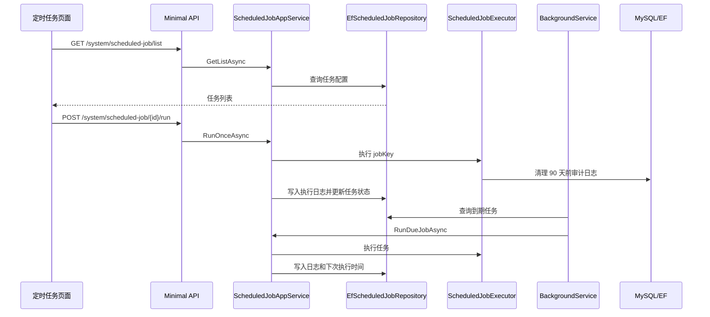

# 定时任务中心需求文档

## 背景

系统已经具备审计日志、登录日志、在线用户、权限诊断等运行态能力。当前审计日志 90 天清理是在应用启动时执行，学习阶段可用，但企业后台更适合放到“系统监控 > 定时任务”中统一管理。

定时任务中心可以让系统自动执行周期性维护任务，并记录每次执行结果，方便排查“任务有没有跑、什么时候跑、跑了多久、结果如何”。

## 目标

- 在“系统监控”下新增“定时任务”菜单。
- 后端新增任务列表、编辑、启停、手动执行、执行日志接口。
- 使用数据库保存任务配置和执行日志。
- 使用后台服务按简单间隔调度启用中的任务。
- 内置第一个任务：清理 90 天前审计日志。
- 保留后续扩展 Quartz/Hangfire 或 cron 表达式的空间。

## 功能范围

- 任务列表查询。
- 修改任务名称、描述、执行间隔、启用状态。
- 手动执行一次任务。
- 查看任务执行日志。
- 后台定时执行启用任务。
- 初始化内置任务和菜单权限。

## 不做范围

- 不做复杂 cron 表达式解析。
- 不做分布式锁和多实例调度。
- 不做任务参数动态表单。
- 不做任务执行中的取消。
- 不做用户自定义代码任务。

## 数据流转

## 权限设计

- `system:scheduled-job:query`：查看任务列表和执行日志。
- `system:scheduled-job:update`：编辑任务配置、启停任务。
- `system:scheduled-job:run`：手动执行一次任务。

## 验收标准

- [x] `系统监控` 下出现 `定时任务` 菜单。
- [x] 管理员可以查询任务列表。
- [x] 初始化后存在 `audit-log-cleanup` 内置任务。
- [x] 可以修改任务执行间隔和启用状态。
- [x] 可以手动执行清理任务。
- [x] 手动执行后会写入执行日志。
- [x] 清理任务会删除 90 天前审计日志，保留 90 天内日志。
- [x] 没有 `system:scheduled-job:run` 权限时不能手动执行。
- [x] 后端完整测试通过。
