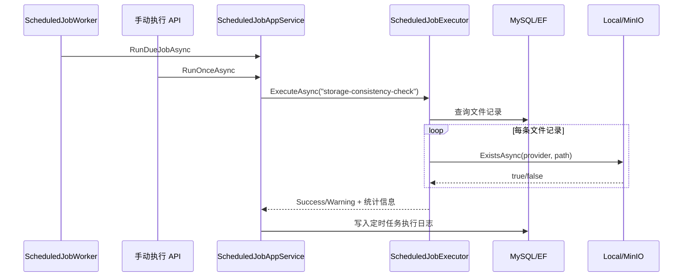

# 文件存储一致性检查任务需求文档

## 背景

系统已经支持本地存储和 MinIO 存储切换，也有文件上传、下载、删除和文件管理页面。企业后台中，文件元数据在数据库，真实文件在外部存储，两边可能因为人工删除、存储故障、迁移不完整等原因出现不一致。

因此需要增加一个内置定时任务，用于检查数据库文件记录和实际存储对象是否一致。

## 目标

- 新增内置任务 `storage-consistency-check`。
- 任务定期扫描 `mini_managed_files` 文件记录。
- 通过现有文件存储抽象检查实际文件是否存在。
- 支持本地存储和 MinIO。
- 手动执行后可以在定时任务日志中看到检查结果。

## 功能范围

- 初始化时写入 `storage-consistency-check` 定时任务。
- 任务结果分三类：
  - `Success`：全部文件存在。
  - `Warning`：存在缺失文件或检查异常。
  - `Failed`：任务执行过程发生未处理异常。
- 执行日志记录检查总数、缺失数量和异常数量。
- 前端对 `Warning` 使用警告色和警告提示。

## 不做范围

- 不自动删除数据库文件记录。
- 不自动补偿丢失文件。
- 不扫描存储桶里“有文件但数据库无记录”的孤儿文件。
- 不做大批量分页扫描优化，本阶段先完成可用闭环。

## 数据流转

## 验收标准

- [x] 定时任务列表存在 `storage-consistency-check`。
- [x] 任务名称为 `检查文件存储一致性`。
- [x] 当文件记录对应的实际文件不存在时，手动执行返回 `Warning`。
- [x] 执行日志记录 `Warning` 状态。
- [x] 本地存储通过 `File.Exists` 检查存在性。
- [x] MinIO 通过 `HEAD` 请求检查对象存在性。
- [x] 后端测试通过。
- [x] 前端构建通过。
