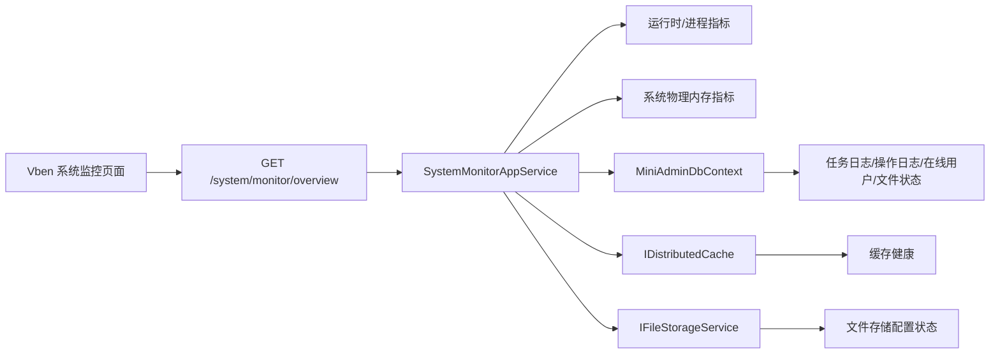

# 系统监控看板总结文档

## 本次完成

本次新增 `系统监控 > 系统监控` 看板，采用当前 MiniAdmin/Vben 风格：浅灰背景、白色信息块、状态 Tag、高密度表格信息，不照搬参考图。

后续根据页面评审做了一轮优化：将 CPU、内存调整为资源看板样式，收紧信息密度，修复宽屏下内容横向撑开的风险；内存指标也从“仅进程运行时内存”补齐为“系统物理内存 + 进程运行时内存”。

后端新增统一监控摘要接口：

- `GET /system/monitor/overview`
- 权限：`system:monitor:query`

接口返回：

- API 当前状态和采样时间。
- CPU：核心数、线程数、进程平均 CPU。
- 内存：系统总内存、可用内存、已用内存、使用率，以及进程工作集、托管堆、GC 堆、GC 次数。
- 应用信息：环境、运行时版本、启动时间、运行时长、内容根目录。
- 服务器信息：机器名、操作系统、系统架构。
- 依赖健康：MySQL、缓存、文件存储。
- 最近状态：近 24 小时任务失败数、异常操作日志数、在线用户数、异常文件数。

前端新增：

- `frontend/vue-vben-admin/apps/web-antd/src/api/system/monitor.ts`
- `frontend/vue-vben-admin/apps/web-antd/src/views/system/monitor/index.vue`

## 数据流

## 验证结果

- 系统监控过滤测试：通过，2/2。
- 后端完整测试：通过，79/79。
- Vben 前端构建：通过。
- 本地 API 实测内存字段正常返回：总物理内存、可用物理内存、已用物理内存、使用率均有值。

## 后续建议

下一步可以在此基础上做“监控自动刷新和阈值提示”：例如每 30 秒刷新一次，并对 Redis 异常、任务失败、异常文件数量显示更明显的告警状态。
