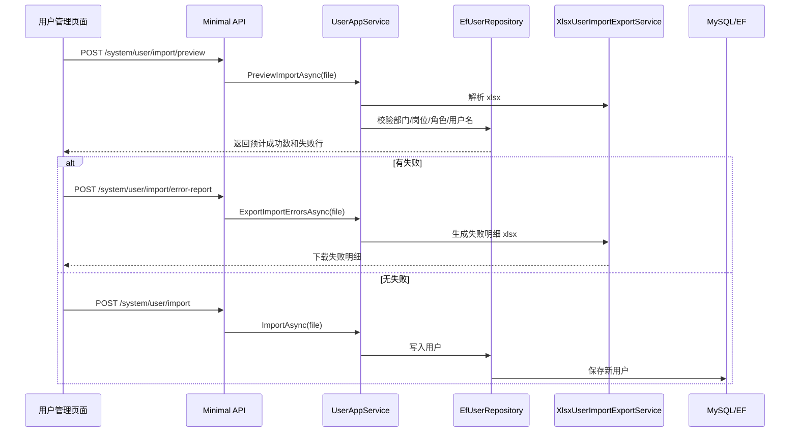

# 用户导入预检与失败明细需求文档

## 背景

基础用户导入已经能上传 Excel 并创建用户，但企业批量导入时更需要“先校验、再确认”。如果 Excel 有几十行错误，只在页面弹窗展示前几条不够用，需要可以下载失败明细，修正后再导入。

## 目标

- 上传 Excel 后先执行预检，不写入数据库。
- 预检返回预计成功条数、失败条数和失败原因。
- 有失败行时支持下载失败明细 Excel。
- 预检无错误时，用户点击确认后才真正导入。
- 保持原有导入权限 `system:user:import`。

## 功能范围

- 新增导入预检接口。
- 新增失败明细下载接口。
- 前端导入流程改为：
  1. 选择 Excel。
  2. 自动预检。
  3. 展示预检结果。
  4. 可下载失败明细。
  5. 无错误时确认导入。

## 不做范围

- 不做服务端长期保存导入文件。
- 不做异步任务和进度条。
- 不做导入历史记录。
- 不做更新已有用户模式。

## 数据流转

## 验收标准

- [x] 预检合法 Excel 时返回预计成功数，但用户列表不新增用户。
- [x] 预检发现错误时返回行号和失败原因。
- [x] 失败明细下载返回 `.xlsx` 文件。
- [x] 前端选择文件后先显示预检结果。
- [x] 有错误时不能直接确认导入。
- [x] 无错误时确认导入后用户列表出现新用户。
