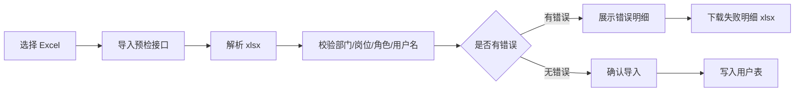

# 用户导入预检与失败明细总结文档

## 本次完成内容

用户导入从“选择文件后直接写库”调整为“先预检、再确认导入”。

- 新增导入预检接口：`POST /system/user/import/preview`
- 新增失败明细下载接口：`POST /system/user/import/error-report`
- 保留确认导入接口：`POST /system/user/import`
- 统一沿用权限：`system:user:import`
- 前端用户管理页面新增“导入预检”弹窗
- 有错误时展示错误行和失败原因，并禁止确认导入
- 有错误时可以下载失败明细 `.xlsx`
- 无错误时点击确认才真正写入用户数据

## 后端实现

后端把 Excel 解析和业务校验拆开：

- `UserAppService` 负责读取上传文件、调用 Excel 服务解析数据、组织预检和错误明细导出。
- `EfUserRepository` 负责校验部门、岗位、角色、用户名等数据库相关约束。
- `ImportAsync` 复用同一套校验逻辑，避免预检通过但确认导入失败时原因不一致。

这次的关键点是 dry-run 校验：预检只返回结果，不调用数据库写入。

## 前端实现

用户在用户列表点击导入后：

1. 选择 `.xlsx` 文件。
2. 前端调用 `/system/user/import/preview`。
3. 打开预检弹窗展示成功数、失败数和错误行。
4. 如果存在错误，可以下载失败明细。
5. 如果没有错误，确认后调用原导入接口写库。

## 数据流转

## 验证结果

- 后端完整测试：68 个测试通过。
- 前端 Ant Design 应用构建通过。

## 后续可扩展

- 导入历史记录：记录导入人、导入时间、成功数、失败数。
- 异步导入任务：适合几千行以上的大文件。
- 更新已有用户模式：支持按用户名或手机号更新用户资料。
- 导入字段映射：允许 Excel 表头和系统字段做自定义映射。
