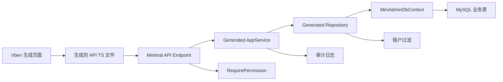

# 代码生成器一期需求文档

## 背景

MiniAdmin 已经具备企业后台的核心底座：认证登录、RBAC、菜单权限、组织岗位、用户、字典、参数、审计日志、文件、系统监控、通知告警、SaaS 租户和套餐。后续业务模块会越来越多，如果每个模块都手写后端 CRUD、前端列表表单、菜单权限和审计接入，开发效率会快速下降，也容易出现风格不一致和权限遗漏。

代码生成器一期的目标不是做拖拽式低代码平台，而是做一个可控的工程生产工具：从已有 MySQL 表读取元数据，经过字段配置和生成预览后，生成符合当前项目分层和 Vben 风格的标准 CRUD 模块。

## 目标

- 支持从当前 MySQL 连接读取业务表和字段元数据。
- 支持为单表 CRUD 配置模块名、业务名、路由、菜单父级、权限前缀、字段显示和表单规则。
- 支持生成前预览文件、接口、菜单、权限和冲突情况。
- 支持安全写入后端和前端文件，不默认覆盖已有文件。
- 支持生成菜单和按钮权限，并接入现有 RBAC 授权体系。
- 支持记录生成历史，知道谁在什么时候生成了什么。
- 支持生成一个标准业务模块后，通过后端测试和前端构建验证。

## 功能范围

### 后端能力

- 新增代码生成器应用服务和接口：
  - 查询数据表列表。
  - 查询数据表字段。
  - 根据表结构生成默认配置。
  - 保存或更新生成配置。
  - 预览生成结果。
  - 执行生成。
  - 查询生成历史。
- 新增代码生成器领域/持久化模型：
  - 生成配置主表。
  - 生成字段配置表。
  - 生成历史表。
- 新增 MySQL 元数据读取能力：
  - 基于 `information_schema.tables` 读取表名、表备注。
  - 基于 `information_schema.columns` 读取字段名、类型、长度、是否可空、默认值、备注、主键信息。
- 新增模板渲染能力：
  - 模板输入使用结构化模型。
  - 模板输出文件路径必须在白名单目录内。
  - 模板渲染后先形成预览结果，再写入文件。

### 生成内容

一期生成单表 CRUD：

- Domain Entity。
- Application.Contracts：
  - DTO。
  - ListQuery。
  - CreateRequest。
  - UpdateRequest。
  - Repository 接口。
- Application：
  - AppService。
- Infrastructure：
  - EF Repository。
  - DbContext `DbSet` 和模型配置。
- Api：
  - Minimal API endpoints。
  - DI 注册。
- Frontend：
  - API TypeScript 文件。
  - Vben Ant Design Vue 列表页。
  - 查询栏。
  - 新增/编辑弹窗。
  - 删除确认。
- RBAC：
  - 菜单。
  - `query/create/update/delete` 按钮权限。
  - 默认授予 Admin 角色。

### 字段配置

每个字段支持配置：

- C# 属性名。
- TypeScript 字段名。
- 显示名称。
- 是否列表显示。
- 是否查询条件。
- 是否新增。
- 是否编辑。
- 是否详情显示，预留。
- 是否必填。
- 查询方式：等于、模糊、范围，范围一期仅预留。
- 表单控件：Input、Textarea、Number、DatePicker、Switch、Select。
- 字典类型编码，供 Select 控件后续扩展。
- 列表排序。
- 表单排序。

### 页面位置

代码生成器页面建议放在：

- 菜单：系统管理 / 开发工具 / 代码生成
- 路由：`/system/code-generator`
- 权限前缀：`system:code-generator`

### 典型业务模块生成位置

生成后的业务模块默认放在：

- 后端命名空间：`MiniAdmin.*.<ModuleName>`
- API 路径：`/business/<kebab-name>`
- 前端 API：`frontend/vue-vben-admin/apps/web-antd/src/api/business/<kebab-name>.ts`
- 前端页面：`frontend/vue-vben-admin/apps/web-antd/src/views/business/<kebab-name>/index.vue`
- 菜单路径：`/business/<kebab-name>`

具体路径在预览阶段展示，用户确认后才写入。

## 不做范围

一期不实现以下能力：

- 拖拽式页面设计器。
- 主子表生成。
- 树表生成。
- 导入导出生成。
- 图表页面生成。
- 自动执行 EF Migration。
- 覆盖已有文件。
- 生成后自动提交 Git。
- 复杂字段联动和复杂表单布局。
- 多数据库元数据读取，一期只读取 MySQL。

这些能力后续可以作为二期、三期扩展。

## 权限与安全

- 代码生成器页面只允许拥有 `system:code-generator:query` 的用户访问。
- 生成操作必须拥有 `system:code-generator:generate`。
- 预览操作必须拥有 `system:code-generator:preview`。
- 配置保存必须拥有 `system:code-generator:update`。
- 生成历史查询必须拥有 `system:code-generator:query`。
- 文件写入必须限制在项目白名单目录：
  - `src/MiniAdmin.Domain`
  - `src/MiniAdmin.Application.Contracts`
  - `src/MiniAdmin.Application`
  - `src/MiniAdmin.Infrastructure`
  - `src/MiniAdmin.Api`
  - `frontend/vue-vben-admin/apps/web-antd/src/api`
  - `frontend/vue-vben-admin/apps/web-antd/src/views`
- 不允许 `..`、绝对路径注入、盘符跳转或写入工作区外目录。
- 默认不覆盖已有文件，冲突必须在预览中标红。
- 生成历史必须记录：
  - 操作人。
  - 生成配置。
  - 生成文件列表。
  - 冲突文件列表。
  - 成功或失败状态。
  - 错误信息。
- 生成的接口必须接入现有 `RequirePermission`。
- 生成的查询必须支持租户隔离配置，不能绕过当前租户边界。

## 租户与数据隔离

代码生成器一期需要支持三种数据归属模式：

- `None`：平台共享数据，不加租户过滤。
- `Tenant`：租户业务数据，必须包含 `TenantId` 并按当前租户过滤。
- `PlatformOnly`：仅平台管理员使用，租户用户不可见。

一期默认推荐 `Tenant`，但表结构必须存在 `TenantId` 字段才允许选择。若表结构没有 `TenantId`，系统应提示用户只能选择 `None` 或先补字段。

## 数据流转

## 生成模块请求链路

## 验收标准

- [ ] 可以在代码生成器页面看到当前 MySQL 数据库的表列表。
- [ ] 可以选择一张表并读取字段、类型、备注、主键、可空信息。
- [ ] 可以基于表结构生成默认配置。
- [ ] 可以调整字段的列表、查询、新增、编辑、必填和控件类型。
- [ ] 可以预览将生成的文件、接口、菜单和权限。
- [ ] 预览能识别已有文件冲突，并默认阻止覆盖。
- [ ] 可以执行生成并写入后端和前端文件。
- [ ] 可以生成菜单和 `query/create/update/delete` 权限。
- [ ] 生成后的页面能通过 RBAC 控制按钮显示。
- [ ] 生成后的接口能通过 `RequirePermission` 控制访问。
- [ ] 生成历史能记录生成人、时间、文件列表和结果。
- [ ] 后端测试通过。
- [ ] 前端 `pnpm run build:antd` 通过。

## 后续扩展路线

1. 二期：主子表、树表、导入导出。
2. 三期：生成历史回滚、差异对比、可覆盖再生成。
3. 四期：更丰富的字段控件、字典自动绑定、部门/用户选择器。
4. 五期：结合 Codex skills，根据业务描述生成初始表结构、字段配置和页面文案。
