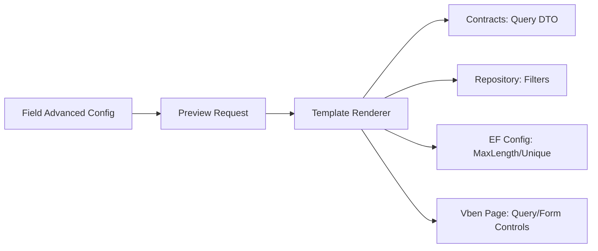

# Code Generator Field Advanced Config Requirements

## Background

The code generator can produce runnable CRUD modules, but field configuration is still too coarse for enterprise scenarios. Real business modules need query behavior, validation hints, dictionary binding, and database constraints to be defined before generation.

## Goals

- Add field-level advanced configuration:
  - query mode: contains, equals, range
  - max string length
  - unique index
  - default value
  - dictionary code
- Use the configuration in generated backend contracts, repository filters, EF mapping, and frontend pages.
- Keep the first version simple and predictable.

## Scope

- Backend generated query supports `Contains`, `Equals`, and date/number `Range`.
- EF mapping uses `MaxLength` and unique indexes.
- Frontend generated page renders configured query controls.
- Frontend generated form renders input, number, switch, date, select, and textarea controls from `ControlType`.
- Dictionary binding is stored in generated code as a stable marker for later dictionary-option loading.

## Data Flow

## Acceptance Criteria

- Previewing an advanced field config generates query DTO properties for query-visible fields.
- `Contains` query mode generates string `.Contains(...)` filter.
- `Equals` query mode generates equality filter.
- `Range` query mode generates begin/end query properties and filters.
- `MaxLength` and `IsUnique` are reflected in EF configuration.
- Generated frontend page includes query controls and selected form controls.
