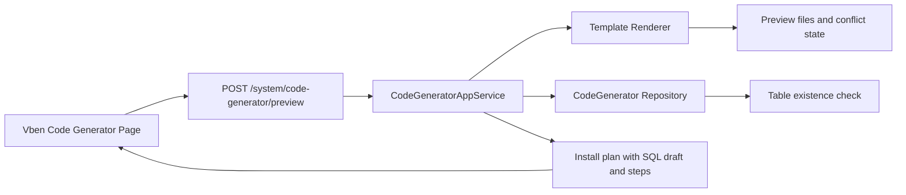

# Code Generator Install Wizard Requirements

## Background

The code generator can already preview and generate backend/frontend CRUD files, but after preview the operator only sees file conflicts. For a real enterprise workflow, the operator also needs to know whether the generated module can be installed safely: whether files will overwrite existing code, whether the target business table already exists, and what manual database script is needed when the table does not exist.

## Goals

- Show an installation readiness panel after preview.
- Keep file conflict detection visible and actionable.
- Check whether the target business table exists.
- When the table is missing, generate a MySQL `CREATE TABLE` draft from the selected fields and tenant mode.
- Show clear next steps after code generation: restart backend, re-enter the page, verify menu permissions and API endpoints.

## First Version Scope

- Attach install guidance to the existing preview API response.
- Do not execute DDL automatically.
- Do not run EF migrations automatically.
- Generate a readable SQL draft that the developer can review before applying.
- Keep the frontend layout consistent with the current code generator page.

## Data Flow

## Acceptance Criteria

- Preview response includes an install plan.
- Missing table returns `tableExists = false` and a non-empty MySQL create table SQL draft.
- Tenant mode includes a `TenantId` column and index in the SQL draft.
- Existing frontend preview still shows files and conflict state.
- Frontend shows install steps and table readiness without blocking the existing preview flow.
