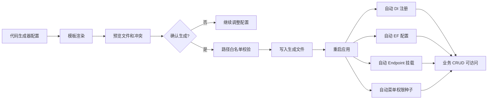

# 代码生成器二期需求文档

## 背景

代码生成器一期已经完成安全预览、默认冲突拦截、生成历史和基础骨架生成。二期要把生成结果向企业级可用推进一步：生成后的单表 CRUD 模块应能接入当前 MiniAdmin 分层、RBAC、Vben 页面和租户隔离约定，经过重启后成为可运行模块。

## 目标

- 生成单表 CRUD 的后端完整闭环。
- 生成单表 CRUD 的前端列表、新增、编辑、删除页面。
- 生成结果通过稳定注册入口接入系统，减少后续生成模块对核心文件的重复修改。
- 生成结果继续遵守路径白名单、预览优先、默认不覆盖和历史记录。
- 生成结果能够支持租户模式和平台模式。

## 范围

### 后端生成内容

- Domain Entity。
- EF EntityTypeConfiguration。
- Contracts：
  - DTO。
  - ListQuery。
  - CreateRequest。
  - UpdateRequest。
  - AppService 接口。
  - Repository 接口。
- Application AppService。
- Infrastructure EF Repository。
- Api EndpointDefinition。
- 菜单权限 SeedDefinition。

### 稳定注册入口

为避免每次生成模块都直接修改 `Program.cs`、`MiniAdminDbContext.cs` 和 `MiniAdminDatabaseInitializer.cs`，二期新增少量稳定入口：

- Application/Infrastructure 服务自动注册：
  - 扫描实现生成器标记接口的 AppService 和 Repository。
  - 自动按接口注册到 DI。
- API endpoint 自动挂载：
  - 扫描实现生成 endpoint 定义接口的类型。
  - 启动时统一 `MapEndpoints`。
- EF 模型配置自动应用：
  - DbContext 调用 `ApplyConfigurationsFromAssembly`。
  - 生成模块提供 `IEntityTypeConfiguration<TEntity>`。
- 菜单权限种子自动执行：
  - 扫描生成种子定义。
  - 初始化时写入菜单、按钮权限和 Admin 角色授权。

## 租户模式

- `Tenant`：
  - Entity 包含 `TenantId`。
  - EF 配置包含 `TenantId` 索引。
  - 查询按 `ICurrentTenant.Id` 过滤。
  - 新增时写入当前租户。
- `PlatformOnly`：
  - 生成接口使用平台权限前缀。
  - 租户用户是否可见由菜单套餐和 RBAC 控制。
- `None`：
  - 不生成租户过滤。

## 前端生成内容

- API TS 文件。
- 页面：
  - 查询栏。
  - 表格。
  - 新增按钮。
  - 编辑按钮。
  - 删除按钮。
  - 新增/编辑弹窗。
  - 权限码控制按钮显示。
- 生成页面沿用当前系统紧凑后台风格，不做营销式布局。

## 安全要求

- 必须先预览再生成。
- 默认禁止覆盖已有文件。
- 生成路径必须在白名单内。
- 不允许绝对路径、`..`、盘符跳转。
- 生成历史记录完整保留。
- 生成 endpoint 必须使用 `RequirePermission`。
- 删除接口必须检查 delete 权限。

## 数据流

## 验收标准

- [ ] 预览结果包含后端完整 CRUD 文件。
- [ ] 预览结果包含 API endpoint 定义文件。
- [ ] 预览结果包含 EF 配置文件。
- [ ] 预览结果包含菜单权限种子文件。
- [ ] 预览结果包含前端 CRUD 页面。
- [ ] 生成服务不需要为每个模块重复改 `Program.cs`。
- [ ] 生成服务不需要为每个模块重复改 `MiniAdminDbContext.cs`。
- [ ] 生成服务不需要为每个模块重复改 `MiniAdminDatabaseInitializer.cs`。
- [ ] 后端 CodeGenerator 测试通过。
- [ ] 后端全量测试通过。
- [ ] Vben 构建通过。

## 不做范围

- 主子表。
- 树表。
- 导入导出。
- 生成 EF Migration。
- 自动运行生成后模块的数据库迁移。
- 覆盖式重新生成。
