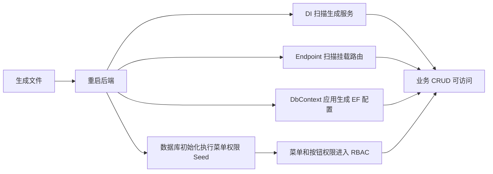

# 代码生成器二期总结文档

## 本次完成

本次把代码生成器从“一期安全骨架”推进到“可运行单表 CRUD 骨架”。生成结果不再只是 Entity、Contract、Service 和前端空列表，而是补齐了后端 endpoint、EF 配置、菜单权限种子、前端新增/编辑/删除页面，以及生成模块的自动注册入口。

## 核心变化

- 新增生成模块 marker：
  - `IGeneratedCrudAppService`
  - `IGeneratedCrudRepository`
- 新增后端自动接入点：
  - 扫描生成 AppService/Repository 并自动注册 DI。
  - 扫描生成 EndpointDefinition 并自动挂载路由。
  - `DbContext` 自动应用生成的 `IEntityTypeConfiguration<TEntity>`。
  - 数据初始化时自动执行生成菜单权限种子。
- 模板新增后端文件：
  - `src/MiniAdmin.Api/Generated/{ModuleName}Endpoints.cs`
  - `src/MiniAdmin.Infrastructure/Persistence/Generated/{ModuleName}EntityTypeConfiguration.cs`
  - `src/MiniAdmin.Infrastructure/Persistence/Generated/{ModuleName}MenuSeed.cs`
- 模板增强前端文件：
  - API 支持 list/create/update/delete。
  - 页面支持查询、分页、新增、编辑、删除。
  - 新增、编辑、删除按钮按权限码显示。
- `Tenant` 模式生成租户隔离：
  - Entity 生成 `TenantId`。
  - Repository 注入 `ICurrentTenant`。
  - 查询、更新、删除按当前租户过滤。
  - 新增写入当前租户。
  - EF 配置生成 `TenantId` 索引。

## 生成后接入流程

## 验证结果

- `dotnet test C:\monica\code\mini-admin\tests\MiniAdmin.Tests\MiniAdmin.Tests.csproj --filter "CodeGenerator"`：5 个测试通过。
- `dotnet test C:\monica\code\mini-admin\MiniAdmin.slnx`：127 个测试通过。
- `pnpm run build:antd`：构建通过。

## 后续建议

下一步可以做“生成后安装向导”：生成完成后提示重启、自动检查表是否存在、展示缺失 SQL，并把生成历史扩展成可查看文件差异。这样代码生成器会更接近企业后台里的低代码开发工具，而不是单纯模板输出器。
